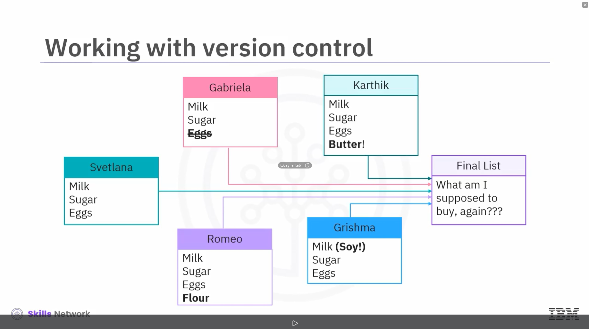
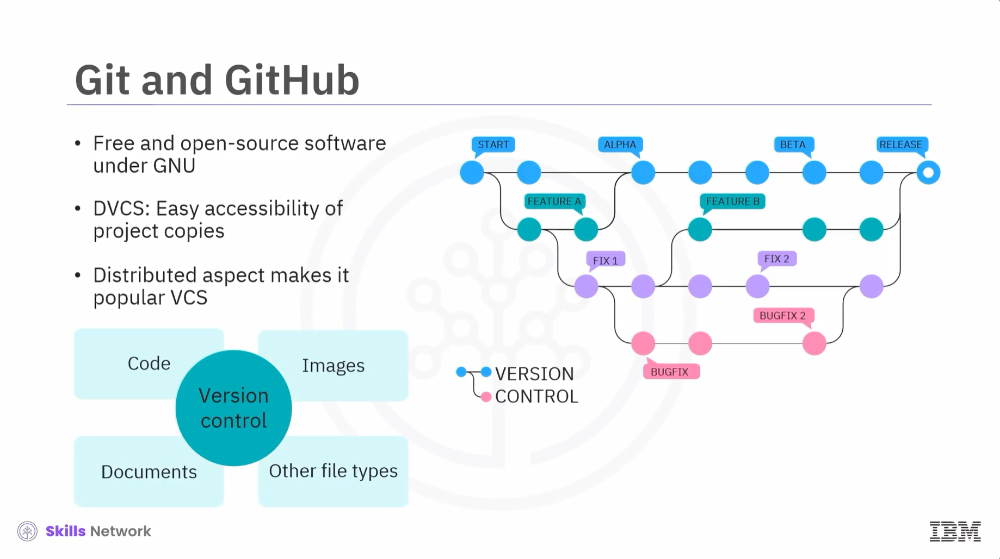
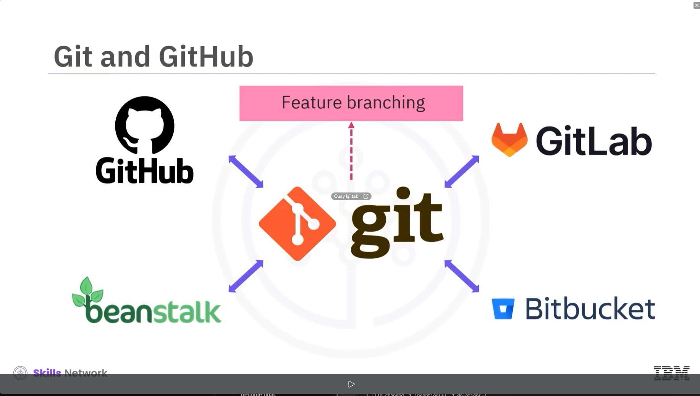
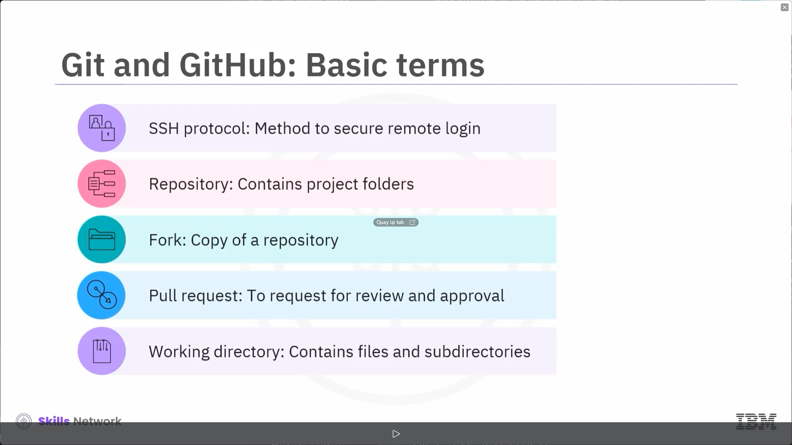
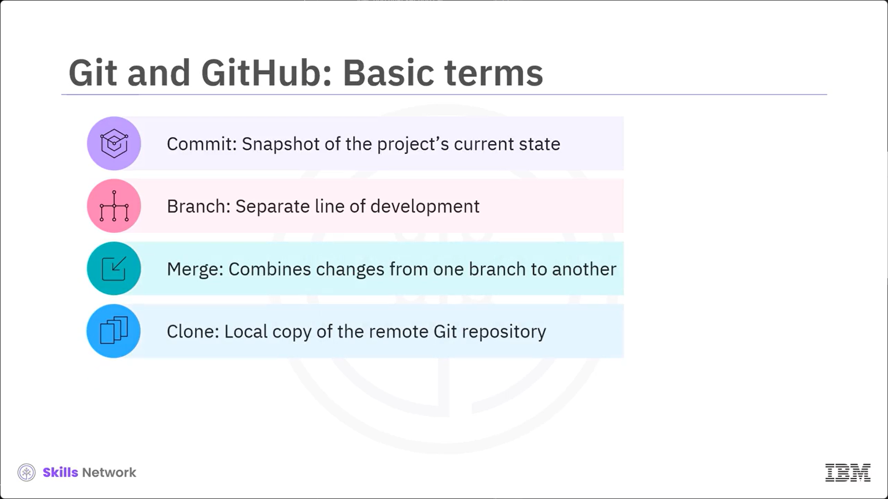

# Lesson 1.2 Overview of Git and GitHub.

# What you will learn:
- Explain what Git and GitHub are, along with some basic terms related to get and GitHub.

- You will also grasp the concept of the version control system and how it is related to Git and Github.

# Version control

 Git and GitHub are popular environments among developers and data scientists, but you can't discuss them without a basic understanding of version control. A version control system lets you track your changes to the source code. This makes it easy for you to recover older versions of your document if you make a mistake. Along with this, it makes collaboration with other team members much easier.
 - Tracks changes to source code
 - Recovers older versions
 - Facilitates collaboration 

 Here's an example to illustrate how version controls work. Let's say you have a shopping list and want your roommates to confirm the things you need and add additional items. Without version control, you've got a big mess to clean up before you can go shopping, with version control you know exactly what you need after everyone has contributed their ideas. 
 

 # Git and GitHub

 Git is free and open source software distributed under the Generral Public license or GNU.
 Git is a distributed version control system, or DVCS, meaning users anywhere in the world can have a copy of your project on their computer. When they've made changes, they can sync their version to a remote server to share it with you. Git isn't the only version control system out there but the distributed aspect is one of the main reasons it has become one of the most popular version control systems available. Version control systems are widely used for things involving code, but you can also version control images, documents, and any number of file types. 
 - Free and open-source software under GNU
 - DVCS: Easy accessibility of project copies
 - Distributed aspect makes it popular VCS

 

 Note that Git also supports branching strategies such as feature branching to organize and manage development. You can use Git without a web interface using your command lined interface but GitHub is one of the most popular web hosted services for Git repositories. Others include Git Lab, Bitbucket, and Beanstock.

 # Git and GitHub: Basic terms

 There are a few basic terms that you will need to know before you get started. The secure shell or SSH protocol is a method for secure remote login from one computer to another. A repository contains your project folders that are set up for version control. A fork is a copy of a repository. A pull request is how you request that someone review and appove your changes before they become final. A working directory contains the files and subdirectories on your computer that are associated with a Git repository.
 - SSH protocol: Method to secure remote login
 - Repository: Contains project folders
 - Fork: Copy of a repository
 - Pull request: TO request for review a approval
 - Working directory: Contains files and subdirectories. 
   

Commit is a snapshot of the project's current state at a specific point in time along with a description of the changes made. A branch is a separate line of development that allows you to work on features or fixes independently. Merging combines changes from one branch into another, typically mergin a feature branch into the main branch. Cloning creates a local copy of a remote Git repository on your computer. 
- Commit: Snapshot of the project's current state
- Branch: Separate line of development
- Merge: Combines changes from one branch to another
- Clone: Local copy of the remote Git repository

  

# Recap

You learned that:
- Git: Versatile version control system for tracking changes in code and collaborating with others
- Due to DVCS, Git enables to revert to the previous state branching strategies: Feature branching
- GitHub: Popular web-hosted services for Git repositories
- Basic terms: SSH protocol, repository, fork, pull request, working directory, commit, branch, merge, and clone.
