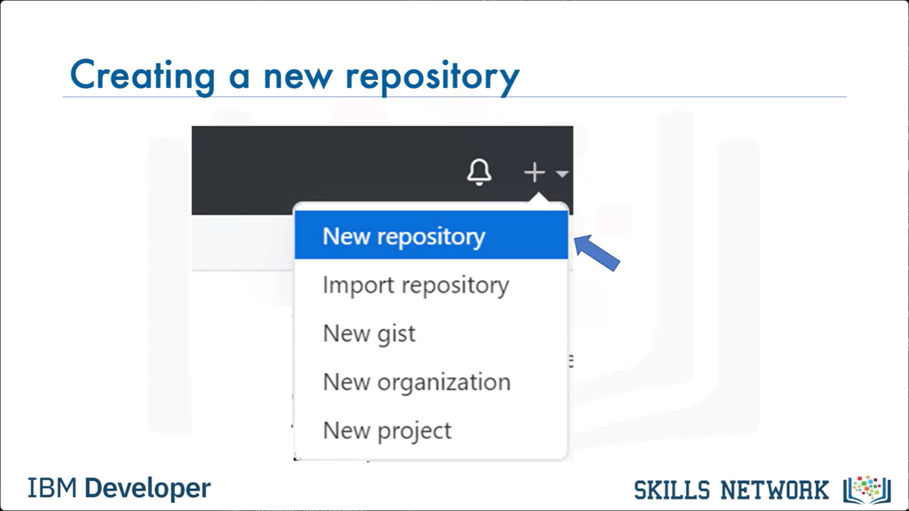
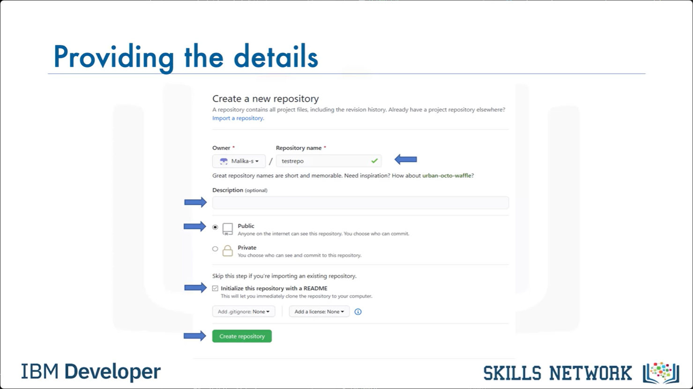
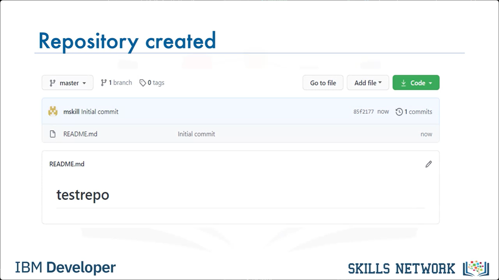
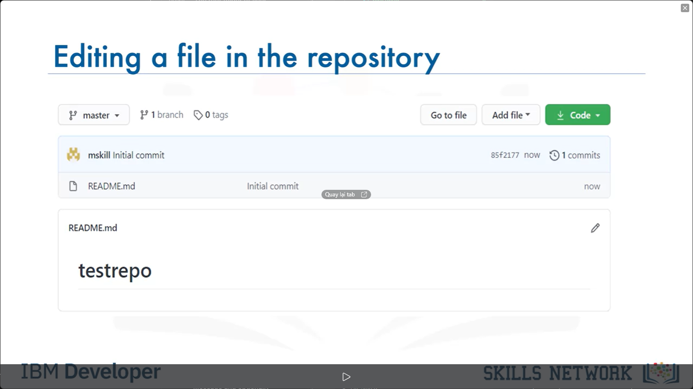
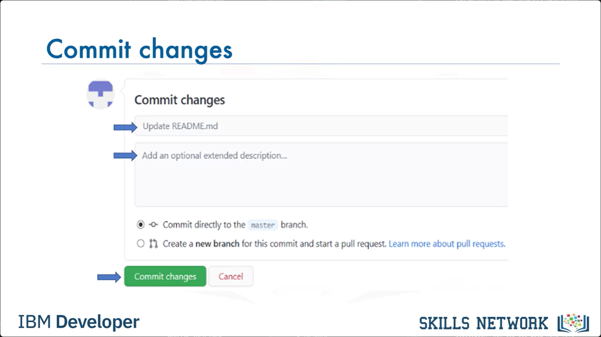
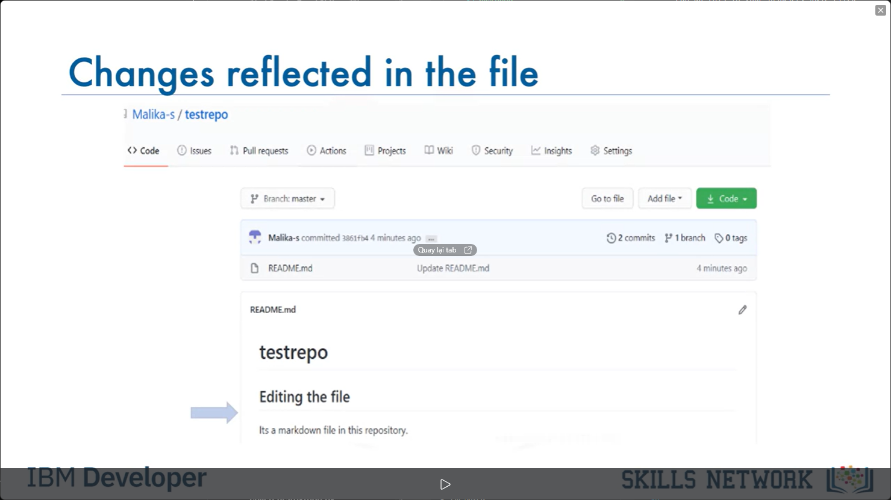
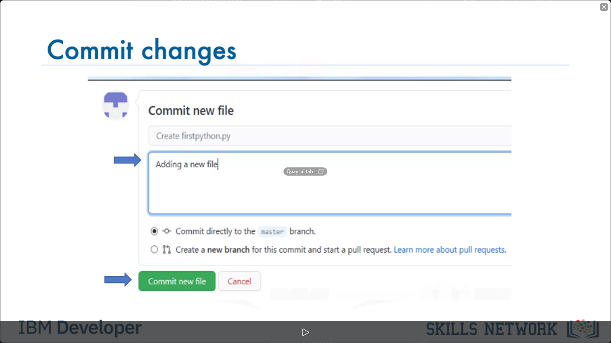
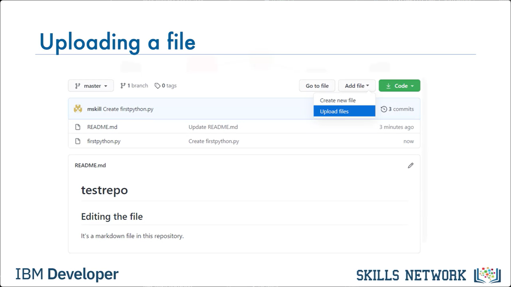
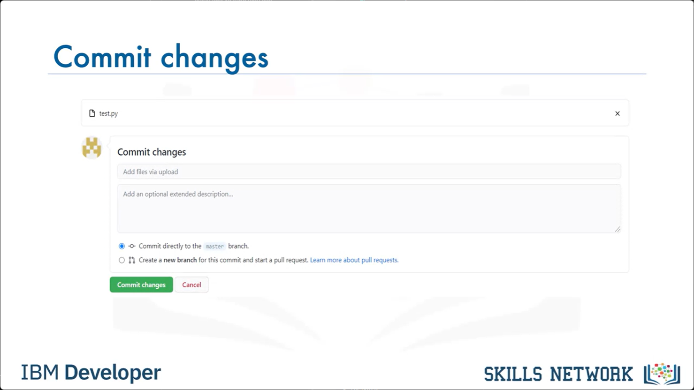
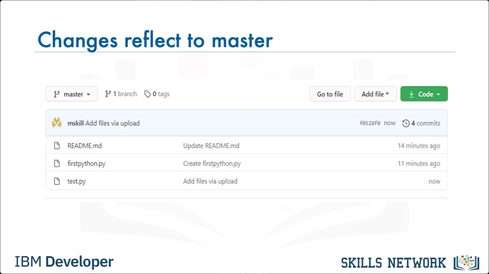

# Lesson 1.5 - GitHub Getting Started

# Creating a new repository

Let's start by creating a new repository. Click + then click New Repository.  

# Providing the details

To create a new repository, you need to provide these details: give your new repository a name; optionally, add a description of your repository; choose the repository visibility - whether you want it to be public or private; and choose the option to initialize this repository with readme file. Then click Create Repository.

# Repository created

You will now be redirected to the repository you have created. The root folder of your repository is listed by default and it has just one file ReadMe.md.

# Editing a file in the repository

Now, it's time to edit the readme. You can do this in your browser. Just click the pencil to open the online editor and you can change the text of the readme. 

# Commit changes

To save your changes to the repository, your must commit them. After you have made your changes, scroll down to the Commit changes section. Add a commit message and optionally add a description, then click Commit changes. The `commit changes` is used to save your changes to the repository. 

# Changes reflected in the file

Go back to the home screen by clicking the repository name link. Note that the readme file is updated and verify your changes. 

# Creating a new file 

Let's learn how to create a new file using the built-in web editor provided by GitHub which runs in the browser. Click Add File, then click Create New File to create the new file. 

# Writing a file content 

To create a python file called fristpython.py. First, provide the file name. Next, add a comment that describes your code, then add the code. 

# Commit changes 

Once finished, commit the change to the repository.

# Changes reflect to master 

 You can see that your file is now added to the repository and the repository and the repository listing shows when the file was added or changed. When you need to change the file, you can edit it again. Click the file name, and then click the pencil icon, make your edits and commit the changes. 

# Uploading a file

You can also upload a file from your local system into the repository. From the home screen of the repository, click Add File and choose the Upload files option.

# Select a file to upload 

 Click Choose Your Files and select the files you want to upload from your local system. The file upload process may take a short time, depending on what you are uploading. 
 

 Once the files finish uploading, click Commit Changes.
 
  

# Changes reflect to master 

 The repository now reflects the files that were uploaded.

# Summary
- Create a repository
- Edit files
- Commit changes