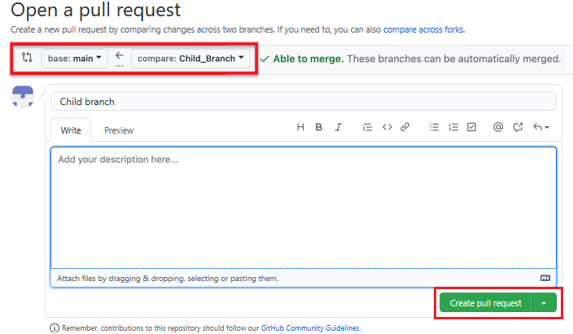
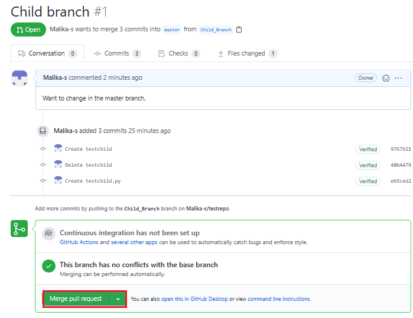

# Lab: Branching and Mergin (Web UI)

# Objectives

After completing this lab, you will be able to:

1. Create a branch 
2. Commit changes to a child branch
3. Open a pull request
4. Merge a pull request into the main branch

# Prerequisites

This hands-on lab requires you to have created a GitHub account with a repository in it, as covered in [Getting stared with GitHub](../1-1_Getting_Started_with_Git_and_Github/Lab_1_1-GitHub_Sign_Up_and_Create_Repo.md) lab

> NOTE: In the past the default branch in your GitHub repo used the name `master`. Effective Oct 1, 2020, all new GitHub repositories will use the more inclusive term `main` as the name of the default branch instead of `master`

# 1. Create a branch

You can create or delete branches using your repository's GitHub web page. To add a branch to your repository, complete the following steps:

1. Go to your repository's main page. Note that when you created your repository, the one branch named main was created for you.

2. At the top of the file list, locate the **Branch** drop-down menu. (By default, the menu displays Branch: main). Click the drop-down menu, type the name of the branch you want to create, and press `Enter` or `return` on your keyboard.

Your repository now has two branches: **Main** and **Child_Branch**. You can click the drop-down menu to see your branches. 

Any files that were in the **main** branch are reflected in the **Child_Branch**. Note that when you add or edit a file in Child_Branch, that change will not automatically reflect in the main branch.

# 2. Add a file to a branch

To add a file to your new branch, ensure that the name you gave the new branch (which in the case of the example showcased is **Child_Branch**) is displayed in the **Branch drop-down menu and complete the following steps:

1. Click **Add file > Create new file** to create a file in the repository.

2. Type a name and extension for the file, for example **testchild.py**, and add the following lines to the body of the new file:

3. Scroll to the bottom of the page, add a description of the file you are about to add (note that the description is optional), and click **Commit**.

The file is added to your child branch.

# 3. Open a pull request

The file that you added to your child branch is not automatically added to the **main** branch. (You can check this by using the **Branch** drop-downmenu to go the **main** branch; note that there is no **testchild.py** file in the file list.)

You can also compare the two branches and open a pull request, which will enble you to merge the changes that you've made in the child branch - in this case, adding a new file - to the **main** branch.

1. In Child_Branch, click the **Compare & pull request** button.

2. Scroll to the bottom of the page and note that there is **1 changed file** listed and the changes are highlighted in green.
 

3. Scroll up and note that GitHub is comparing the **main** and **Child_Branch** branches and that therer are no conflicts between the two. Optionally, you can add a comment to the pull request. Click **Create pull request**
 

The pull request has been successfully created and is now ready to be merged by a repository administrator. For all the repositories that you create, you automatically have administrative rights. 

# 4. Merge a pull request

To merge a pull request into a project, complete the following steps:

1. Click the **Pull requests** tab. A list of pending pull requests is displayed.
 

2. Click the pull request that you want to merge into the main project. Review the changes, click **Merge pull request** to accept the pull request and merge the updates. (You can optionally add a comment).
 

 3. When you click **Merge pull request**, a **Confirm merge** button is displayed. Click that button to complete the merge. 
 

The pull request has now been merged successfully. Note that you can delete the child branch becasue your changes have been incorporated into the **main** branch.
 

Check the list of files in the **main** branch to confirm that it now includes the file that you added in the pull request.
 

 # Summary
 You've now learned how to create a branch, edit and commit changes in that branch, open a pull request, and merge the pull request into your main project. We encourage you to continue to experiment with branches and pull requests to become more familiar with the concepts and processes. 
 
