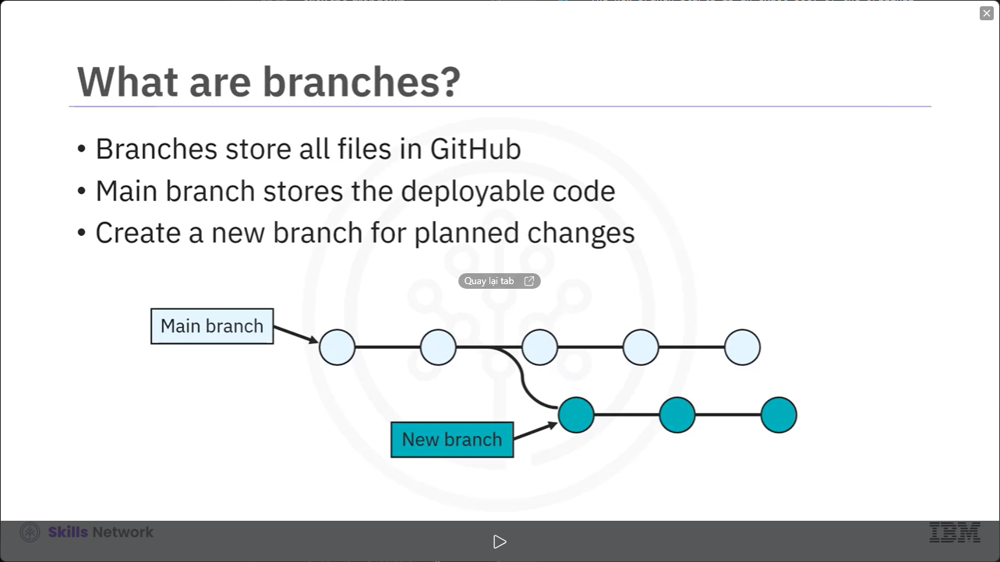
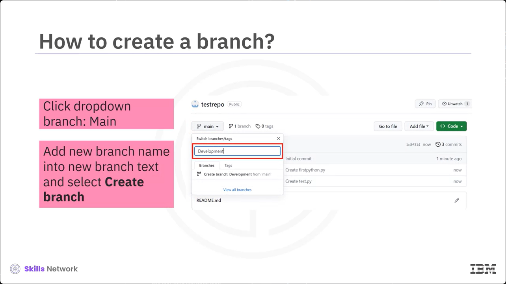
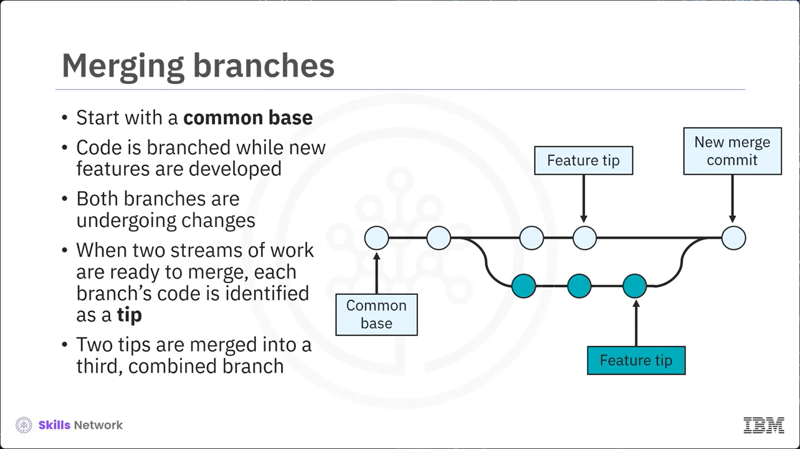
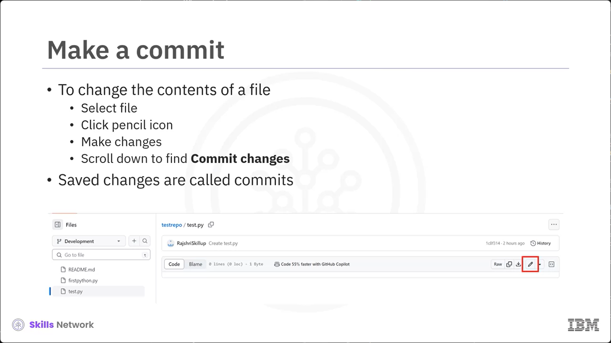
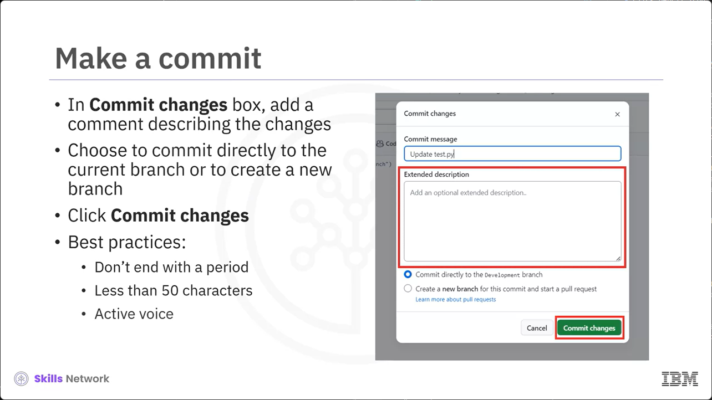
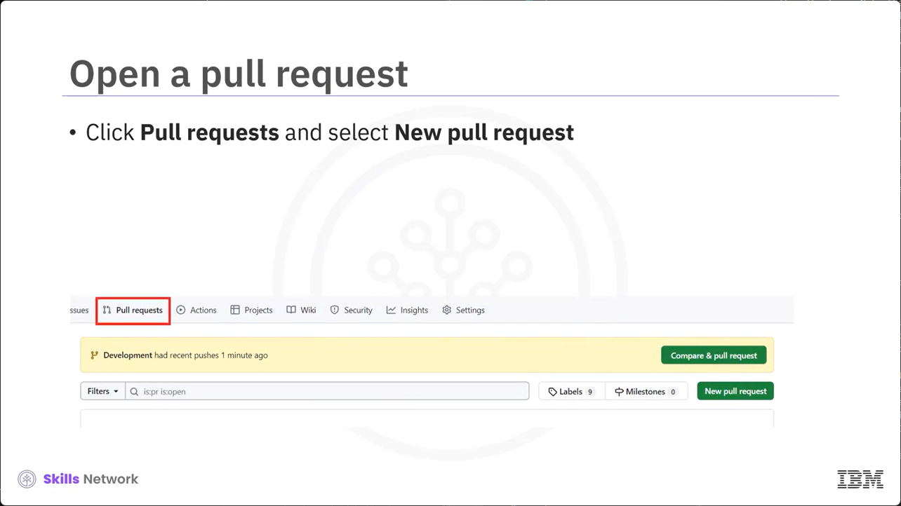
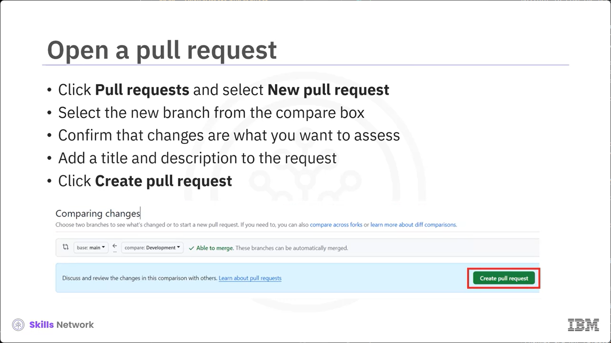

# Lesson 1.2.1 GitHub Branches

# What you wil learn:
- Explain the purpose of branches
- Describe how to merge changes into branches

# What are branches?

All files in GitHub are stored on a branch. The main branch is definitive, it stores the deployable version of your code. 

The main branch is created by default, however, you can use any branch as the main, finished, deployable version of the code. When you plan to change things, you create a new branch and give it a descriptive  name.

The new branch starts as an exact pocy of the original branch. As you make changes, the branch you created holds the changed code. 

- Branches store all files in GitHub
- Main Branch stores the deployable code.
- Create a new branch for planned changes. 

# How to create a branch?

To create a new branch, click the dropdown branch Main, add new branch name into a new branch name into a new branch text and select "Create Branch". 

# Mergin branches

GItHub branches can be very complex for large software projects. For a simple poject such as the ones we are exploring, consider the following. Start with a commmom base, the initial source for this project. 

At one point, the code is branches while new features are developed. In this example, both branches are undergoing changes. When the two streams of work are ready to merge, each branch's code is identified as a top, and the two tips are merged into a third combined branch.

- Start with a commom base.
- Code is branched while new features are developed
- Both branches are undergoing changes
- When two streams of work are ready to merge, each branch's code is identified as a tip
- Two tips are merged into a third, combined branch.

# Make a commit

Developers work on source files in a branch. Since some projects take a while, the source doesn't make sense right aways. To change the contents of a file, select the file, click the pencil icon, make the changes, commit te changes. when the developer has completed their assigned work, to save their changes, they commit the code. Commit indicates that the developer is convinced that the code represents a stable plaform for the feature or set of features being developed. 

- To changes the contents of a file
    - Select file
    - Click pencil icon
    - Make changes
    - Scroll down to find Commit changes 
- Saved changes ar called commits 

When a developer commits a change source to their path, they are required to write a comment that describes the changes. The comment should be meaningful and descriptive. The developer can choose to commit to the current branch or create a new branch. Finally, click "Commit changes". Some best practices while writing a comment: don't end the comment message with a period, keep commit messages under 50 characters. 

Use the extended window for the details. Always write in an active voice. 

- In Commit changes box, add a comment describing the changes.
- Choose to commit directly to the current branch or to create a new branch
- Click commit changes
- Best practices:
    - Don't end with a period
    - Less than 50 characters
    - Active voice. 

# What is pull request?

A pull request makes the proposed commited changes available for others to review and use. A pull can follow any commits even if the code is unfinished. A pull requires a user to appove the changes. This can be the author of the change or can be assigned within the team. Note that GitHub automatically makes a pull request on your behalf if you make a change on a branch that you do now own. Since the log files are immutable, it is always possible to find the person who approve the merge of the change. 

- Makes the proposed (commited) changes available for others to review and use.
- Can follow any commits, even if code is unfinished.
- Can target specific users.
- GitHub automatically makes a pull request if you make a change on a branch you do not own.
- Log files record the approval of the merge 

# Open a pull request 

To open a pull request, click "pull requests" and select "new pull requests". 

Select the new branch from the compare box. 

Scroll down to view the changes. Confirm that the changes are what you want to assess.

 Add the title and description to the request.
 
 Click "Create pull request"

 # Mergin into the main branch 

 The intent of Git repository if for the main branch to be the only deployed code. Developers can change source files in a branch, but the changes are not released until they are commited. A pull command is issued, the code is reviewed and approved. The approved code is merged back into the main code
 
 - Main branch: The only deployed code
 - Developers can change source files in a branch
 - Changes are not released until:
    - Commited
    - Pull command is issued
    - Code is reviewed and approved
    - Approved code is merged into the main

# Merge a pull request

To merge a committed code change into your main code, click "Merge pull request", click "Confirm merge". When all changes for a branchh are complete, that branch is considered obsolete and should be deleted. 

- To merge a committed code change into the main code
    - Click Merge pull request
    - Click Confirm merge
    - Delete the obsolete branch

# Summary
- Main branch contains the finished, deplayable version of the code.
- New branches are created to change code
- Created branch holds  the changed code
- Changes are saved using commits
- Pull requests are used to share code changes for review
- When the code is ready to deploy, merge it back into main