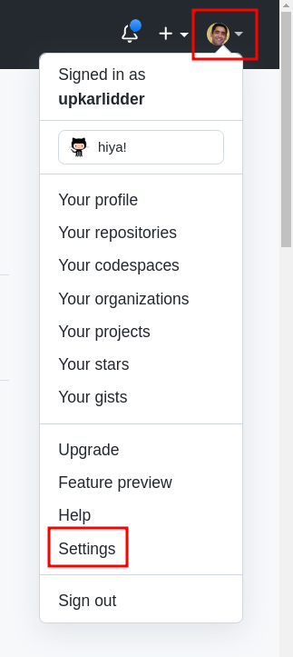
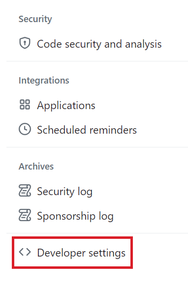
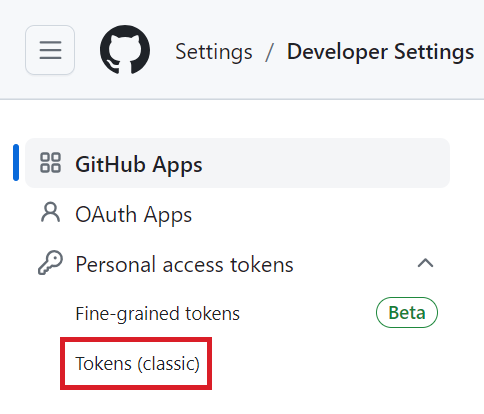
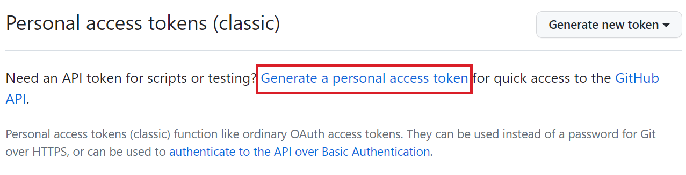
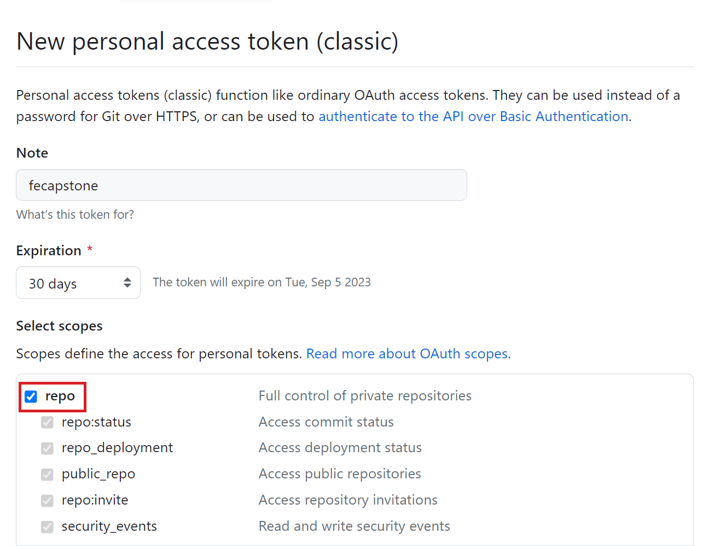
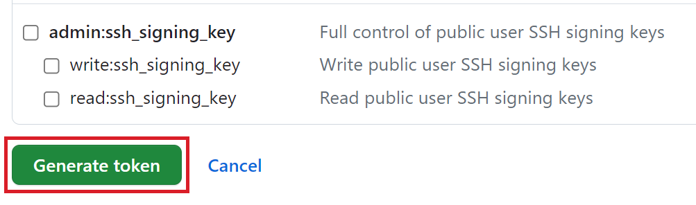

# Lab 2.1.0 Generate GitHub personal access token 

# Objectives

The goal of this lab is the create a `personal access token`. Personal access tokens function like ordinary OAuth access tokens. They can be used instead of a password for Git over HTTPS.

# Pre-requistites

This lab requires a Github.com account. Additionally, verify your email address if it hasn't been verified on GitHub.

# Exercise 1: Generate personal access token

Let's firts create a personal access token that you will use as a password with pushing code back to GitHub.com

1. Open [GitHub.com](https://github.com/). In the upper-right corner of any page, click your profile photo, then click Settings.

2. Next, select Developer settings. This option is typically available towards the bottom of the window.

3. Navigate to `Tokens (classic)` under Personal access tokens.

4. To generate an access token, click `Generate a personal access token`

5. In the Generate token page, fill in the required details and click the repo checkbox to enable access for `git` commands. 

6. Then, click **Generate token**

7. Your personal access token will be generated. The token is only valid for **30 days**. You will need to generate a new token once the current token expires. 

**REMEMBER** : Make sure to copy your personal access token now. You won't be able to see it again.