# Hands-on Lab: Getting Started with Branches using Git Commands

# Objectives

After completing this lab, you will be able to use git commands to work with branches on a local repository, including:

1. Create a new local repository using `git init`
2. Create and add a file to the repo using `git add`
3. Commit changes using `git commit`
4. Create a branch using `git branch`
5. Switch to a branch using `git checkout`
6. Check the status of files changed using `git status`
7. Review recent commits using `git lgo`
8. Revert changes using `git revert`
9. Get a list of branches and active branches using `git branch`
10. Merge changes in your active branch into another branch using `git merge`

# Initialize: Open a new terminal window

Open a terminal window in your IDE where you can start entering your shell and Git commands.

1. Click on the `Terminal` menu to the right of this instructions pane and then click on `New Terminal`

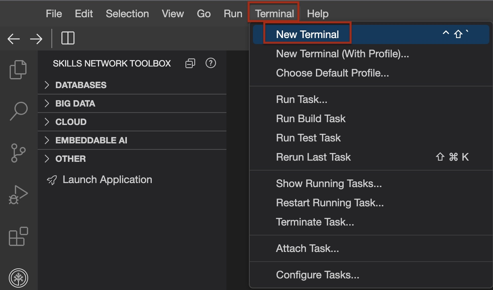

2. This will add a new terminal window at the bottom where you can start entering commands. 

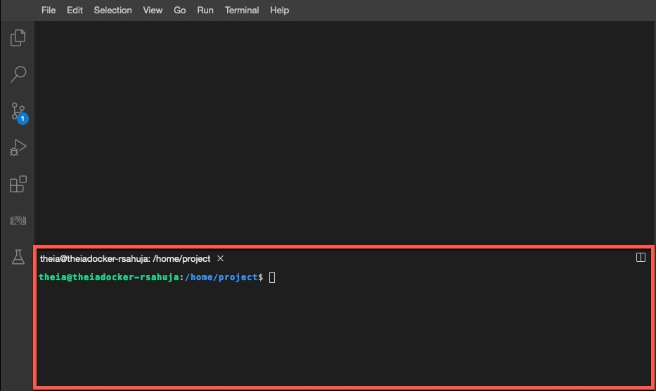

# Exercise 1: Create a new local repo.

1. Create a `myrepo` directory by running the `mkdir` command given below in the terminal.

```
mkdir myrepo
```

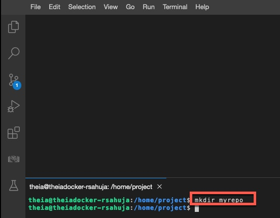

```
mkdir myrepo
```

2. Go into the `myrepo` directory by running the following command.

```
cd myrepo
```

3. Initiate the `myrepo` directory as a git repository by using the `git init` command

```
git init
```

4. A local git repository is now initiated with a `.git` folder containing all the git files, which you can verify by doing a directory listing by running the following command into the terminal window. The `.` prefix will make the git directory hidden. The `-la` option renders a long list, including the access permission, time of creation and other details for all the files in the hidden git directory.

```
ls -la .git
```

The output shows the contents of the `.git` sub-directory which contians all the information required by git server. 

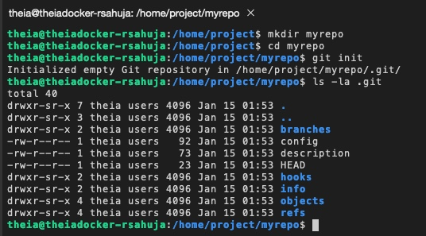

# Exercise 2 - Create and add a file to the local repo

1. Now create an empty file named `newfile` using the following `touch` command.

```
touch newfile
```

2. Add this file to the repo use the following `git add` command
```
git add newfile
```
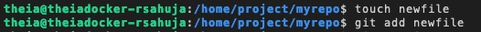

# Exercise 3 Commit changes

1. Before you commit the changes, you need to tell Git who you are. You can do this using the following commands. Replace `you@example.com` with the email address you use to login to GitHub. Replace **Your name** with your name
> Please note the email and name have to be withing quotes.

```
git config --global user.email "you@example.com"
```

```
git config --global user.name "your name"
```

2. You can now commit your changes using the following `git commit` command
> Note that the commit requires a message, which you cna include using the `-m` parameter. 

```
git commit -m "added newfile"
```

# Exercise 4: Create a branch

1. Your previous commit created a default main branch called `master`.
2. To make subsequent changes in your repository. Run the following `git branch` command into the terminal to create a branch called `my1stbranch`
```
$ git branch my1stbranch
```

# Exercise 5: Get a list of branches and active branch

1. Check the lsit of branches your repository contains by running the following `git branch` command.
```
git branch
```

2. Note that the output lists two branches: The default `master` branch with an asterisk `*` next to it indicating that it is the currently active branch and the newly created `my1stbranch`

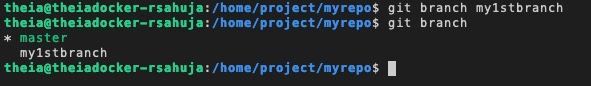

# Exercise 6: Switch to a different branch

1. Since you now want to work in the new branch to make your changes, run the following `git checkout` command to make it the active branch.

```
git checkout my1stbranch
```

2. Verify that the new branch is now the activve brach by running the following `git branch` command

``` 
git branch
```

3. Note that the asterisk `*` is now text to the `my1stbranch` , idicating that it is now active 

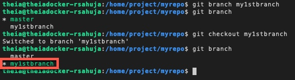

> As a shortcut, instead of creating a branch using `git branch` and then making it active using `git checkout`, you can use the git checkout command followed by the `-b` option, that creates the branch nad makes it active in one step.
```
git checkout -b my1stbranch
```

# Exercise 7: Make changes in your branch and check the status of files added or changed.

1. Make some changes to your new branch, called `my1stbranch`. Start by adding some text to `newfile` by running the following command into the terminal that will append the string "here is some texst in my newfile". into the file
```
echo 'here is some text in my newfile.' >> newfile
```

2. Verify the text has been added by running the following `cat` command.

```
cat newfile
```
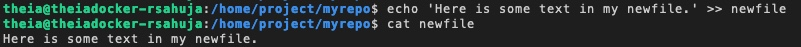

3. Now, create another file called `readme.md` using the following command. 

``` 
touch readme.md
```

4. And now, add it to the repo with the following `git add` command
```
git add readme.md
```

5. So far, in your new branch, you have edited the `newfile` and added a file called `readme.md`. You can easily verify the changes in your current branch using `git status` command.
```
git status
```

6. The ouptu of the `git status` command shows that the file `readme.md` has been added to the branch and is ready to be committed since you added it to the branch using `git add`. However, even though you modified the file called `write` you did not explicitly add it using `git add`, and hence it is not ready to be committed.

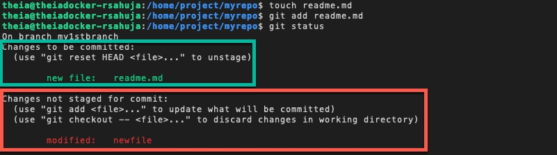

7. A shortcut to adding all modifications and additions is to use the following `git add` command with an asterisk `*`. This will also add the modified file `newfile` to the branch and make it ready to be commited.

``` 
git add *
```

8. Let's check the status again
```
git status 
```

9. The output now shows that both the files can now be committed.

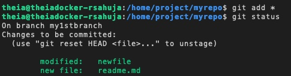

# Exercise 8: Commit and review commit history

1. Now that your changes are ready, you can save them to the branch using the following commit command with a message indicating the changes.
```
git commit -m "added readme.md modified newfile"
```

2. We can run the following `git log` command to get a history of recent commits:
```
git log
```
3. The log shows two recent commits: The last commit to `my1stbranch` as well as the previous commit to `master`

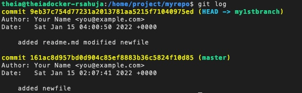

> Note: To exit the `git log` command, simply press the "Q" key. This action will close the log view and bring you back to the command prompt.

# Exercise 9: Revert committed changes

1. Sometimes, you may not fully test your changes before commiting them, which may have undersirable consequences. You can back out your changes by usign a `git revert` command like the following.

You can either specify the ID of you commit that you can see from the previous log output or use the shortcut `HEAD` to rollback the last commit:

```
git revert HEAD --no-edit
```

> NOTE: If you don't specify the `--no-edit` flag, you may be presented with an editor screen showing the message with changes to be reverted. In that case, press the `Control` (or Ctrl) key simultaneously with `X`.

2. The output shows the most recent commit with the specified id has been reverted. 

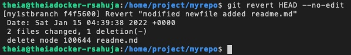

# Exercise 10: Merge changes into another branch

1. Let's make one change in your currently active `my1stbranch` using the following commands.
```
touch goodfile
git add goodfile
git commit -m "added goodfile"
git log
```
2. The output of the log shows the newly added `goodfile` has been comitted to the `my1stbranch` branch :

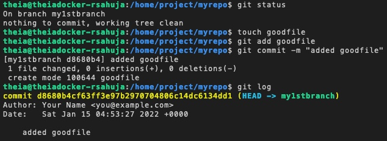

> Note: To exit the `git log` command, simply press the `Q` key. This action will close the log view and bring you back to the command prompt. 

3. Now, let's merge the contents of the `my1stbranch` into the `master` branch. We will first need to make the `master` branch active using the following `git checkout` command
```
git checkout master
```
4. Now, let's merge the changes from `my1stbranch` into master
```
git merge my1stbranch
git log
```

5. Output and log shows the successful mergin of the branch


6. Now that changes have been merged into `master` branch, the `my1stbranch` can be deleted using the following `git branch` command with the `-d` option:
```
git branch -d my1stbranch
```
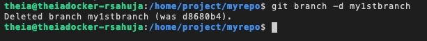

# Exercise 11: Practice on your own

1. Create a new directory and branch called `newbranch`
<details>
<summary>Click here for Solution</summary>
```
mkdir newbranch
git init
ls -la .git
```
</details>

2. Make `newbranch` the active branch

<details>
<summary>Click here for Solution</summary>

```
git branch newbranch
git branch 
git checkout newbrach 
git branch
```
</details>

3. Create an empty file called `newbranchfile`

<details>
<summary>Click here for Solution</summary>

```
touch newbranchfile
```
</details>

4. Add the newly created file to your branch
<details>
<summary>Click here for Solution</summary>

```
git add newbranchfile
```
</details>

5. Commit the changes in your `newbranch`
<details>
<summary>Click here for Solution</summary>

```
git commit -m "add a file newbranch"
```
</details>
6. Revert the last commited changes

<details>
<summary>Click here for Solution</summary>

```
git revert HEAD --no-edit
```
</details>

7. Create a new file called `newgoodfile`
<details>
<summary>Click here for Solution</summary>

```
touch newgoodfile
```
</details>
8. Add the lastest file to `newbranch`
<details>
<summary>Click here for Solution</summary>

```
git add newgoodifle
```

</details>
9. Commit the changes
<details>
<summary>Click here for Solution</summary>

```
git commit -m "add a new file"
```
</details>
10. Merge the changes in `newbranch` into `master`.

<details>
<summary>Click here for Solution</summary>

```
git checkout master
git merge newbranch
git log
```
</details>
# Summary

In this lab, you have learned how to create and work with branches using Git commands in a local repository. In a subsequent lab,  you learn how to synchronize changes in your local repository with remote GitHub repositories. 
