# Lab 2.1.2 - Get familiar with fork and pull requests

# Objectives

After completing this lab, you will be able to:

1. Use git commands to manage upstreame repositories

2. Create a personal access token

3. Fork existing repository using the UI

4. Clone forked repository in the lab environment 

5. Create a new branch

6. Make changes locally

7. Add and commit the local branch

8. Push changes to the forked repository

9. Create a pull request to the upstream repository

# Exercise 1: Generate personal access token 

The first step is to generate an access token from GitHub.com Follow the lab named [Generate Github personal access token](./Lab_2_1_0-Generate_personal_access_token.md) and copy the access token to use as a password in the upcoming exercises. 

# Exercise 2: Fork the repository

To fork a source repository, complete the following steps:

1. Log in to GitHub and go to this project's [sample source repository](https://github.com/ibm-developer-skills-network/gkpbt-css-circle). This is the upstream repository for your project. 

2. At the top right of the screen, click `Fork` and select your own GitHub account as the destination for the fork.

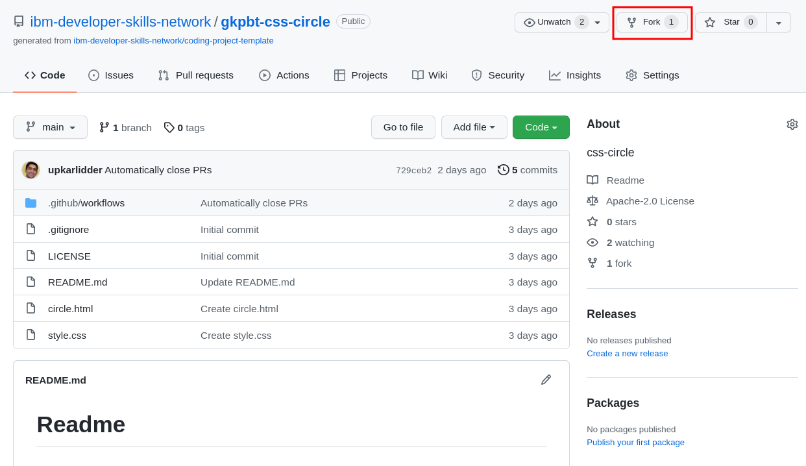

A copy of the source repository has now been added as one of your GitHub repositories. This is origin repository. 

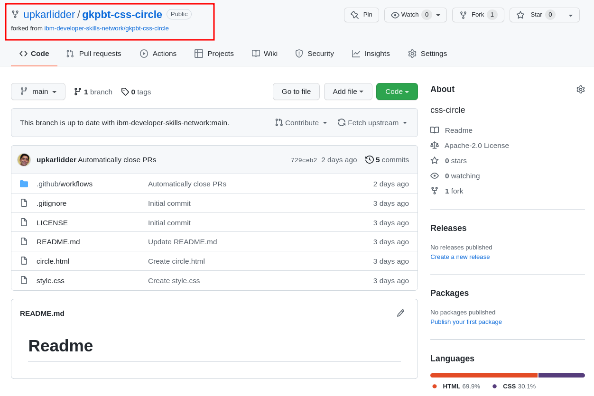

a copy of the source repository has now been added as one of your GitHub repositories. THis is the origin repository.


# Exercise 3: Clone the forked repository.

A clone is a local copy of a repository. Before you can clone the forked repository, you first need its HTTPS URL, which provides secure access to it. 

To clone the forked repository, complete the following steps:
1. In your list of repositories, click the forked repository. On the repositor's main page, click the **Code** button.

2. Click the clipboard icon to copy the URL. Make sure the `HTTPS` tab is active.


3. Open the terminal in the lab environment by using the menu in the editor: Terminal > New Terminal.

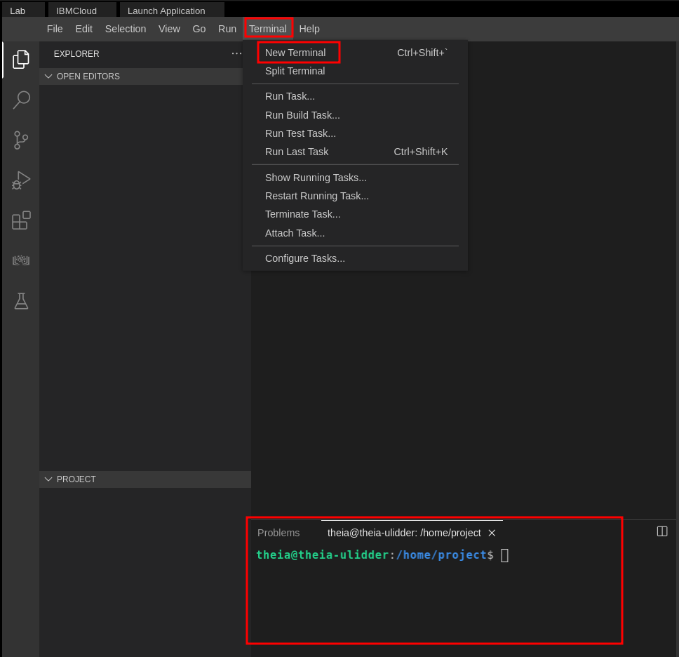

4. Let's export the copied URL in an environment variable so it's available for us to use in the later steps, run the following command in terminal:

```
export ORIGIN=<your repository HTTPS URL>
```
> Replace <your repository HTTPS URL> with the URL you copied in step 2.

5. Run the following command with the `HTTPS` URL you copied earlier:

```
git clone $ORIGIN
```
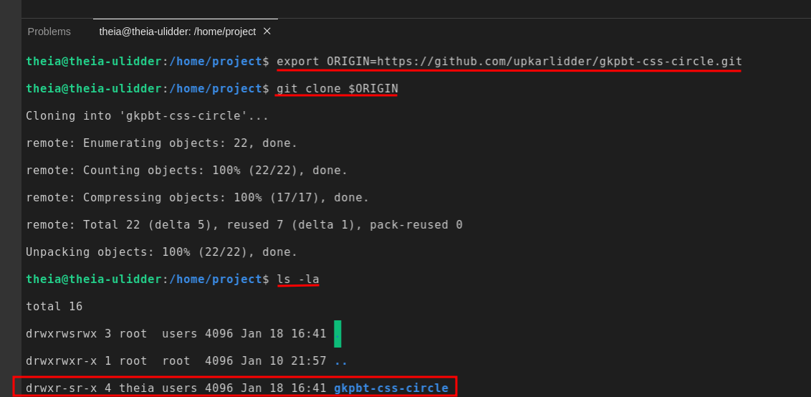

The command clones the repository that is on GitHub into your current directory. 

# Exercises 4: Explore the cloned repo

To become familiar with the cloned repo, complete the following steps:

1. Click the Explorer icon as shown in the following image:

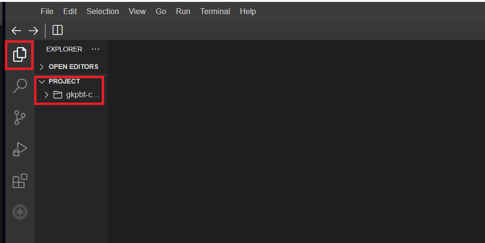

2. Click Project and expand the folder of the project you just cloned. You can open the files in the editor, on the right side, by clicking on the file name.

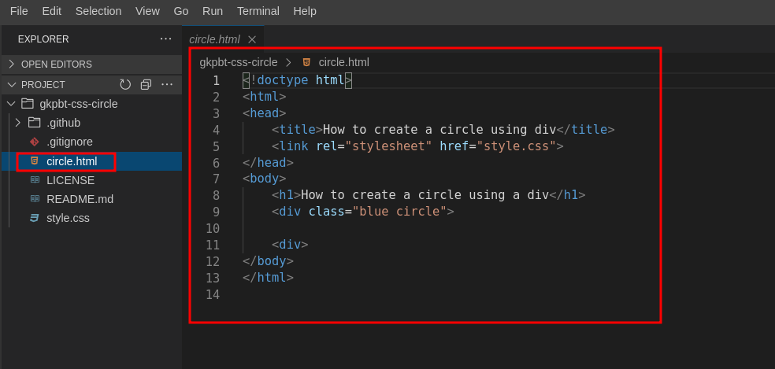

# Exercise 5: Create the `feature-circle-500` branch

We will now add a new feature to the source code. We will increase the circle's size to 500x500 pixels. Berfor we make this change, we wil create a new branch.

1. Navigate to our repository using this command `cd gkpbt-css-circle`

2. Create a new branch using the `git checkout -b feature-circle-500` command. Notice that we used a single command instead of creating a branch and then checking it out. The `-b` flag creates the branch if it does not already exist.

3. You can check that you are in the new branch by using the `git branch` command.

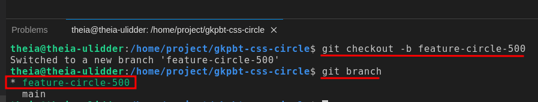

# Exercise 7: Add and commit your changes

A commit is GIt's way of recording your file changes, similar to how you might have save an edited document. To commit the change that you made in the previous exercise, you first need to add it to a staging area. Git will then take the staged sanpshot of changes and commit them to the project. Remember, Git will never change files unless you explicitly ask it to.

To commit your new file, complete the following steps:

1. To move the changes from your working project directory to the staging area, type the following command in the Terminal window:

```
git add .
```

> The `git add` command has several options. The single `.` adds all untracked files in the current directory and subdirectories to the staging area. Alternatively, you can add the single file you created by using the `git add style.css` command. Finally, you can use `git add -A` to recursively add all files from the top level git folder.

2. If you check the status at this point, you will see the file has changed from Untracked to `Changes to be commited`:

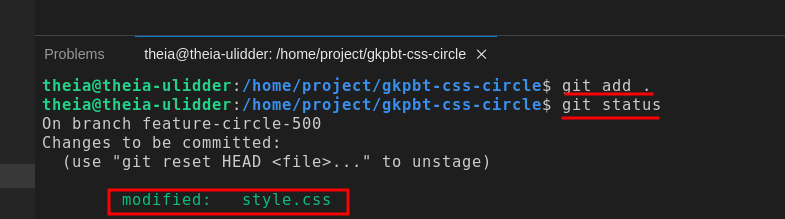

3. To commit the new file to the local repository, you need to first tell git who you are. Type in the following commands to set your email and username. The email should be the same as you GitHub email.

Set your email:
```
git config --global user.email "email@example.com"
```
Set you name:
```
git config --global user.name "Your name"
```

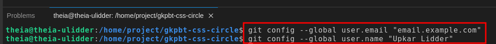

4. Type the following command in the Terminal window to commit the file. 
> Note: It's always a good practice to add a description for the commit so you can remember what the change was if you have to refer to it later.

`-m` flag: It is used in Git commit commands to specify the commit message directly in the command line, allowing yoiu to provide a brief description of the changes you are committing.

```
git commit -m "Changing the height and the width of the circle"
```

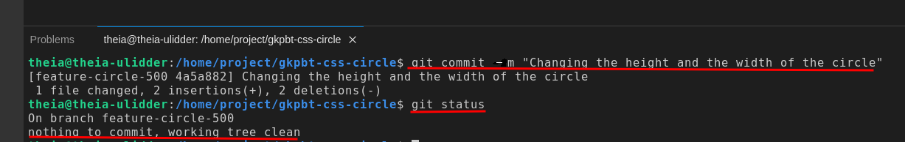

As you can see, `git status` now says there is nothing to commit and the working tree is clean. The new file is now ready to by pushed from your local system to origin on GitHub.

# Exercise 8 Merge your branch back into main branch

It you are happy with your changes in the `feature-circle-500` branch, you con now merge it back into your local `main` branch by following thses steps:

1. Confirm that you are currently in the `feature-circle-500` branch

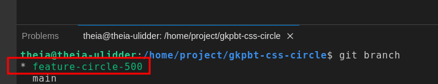

2. Check out the `main` branch

```
git checkout main
```

If you run `git branch` again, you should see the `*` against the `main` branch

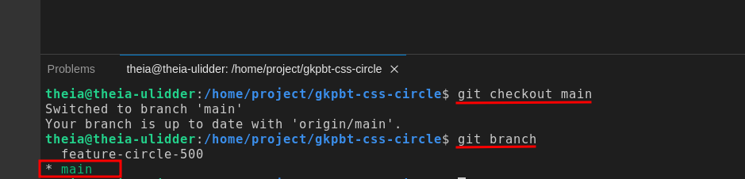

3. Merge the `feature-circle-500` branch into `main`

```
git merge feature-circle-500
```

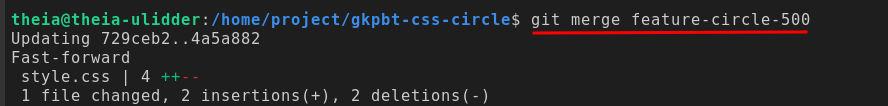

4. Confirm the changes was merged by using the `git log` command. We are using `--oneline` flag to display logs more concisely.

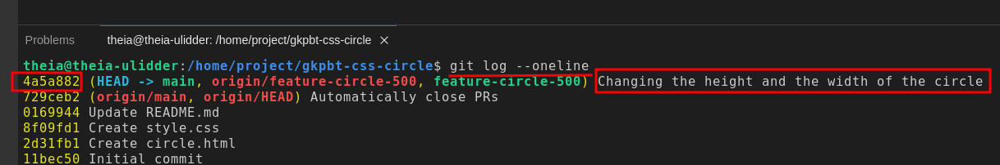

> Note: To exit the `git log` command, simply press the `Q` key. This action will close the log view and bring you back to the command prompt. 

# Exercise 9 : Delete the `feature-circle-500` branch

Since you are done making the change, let's delete the `feature-circle-500` branch by following these steps:

1. Ensure you are on the `main` branch. If not, check it out first.
```
git checkout main
```
2. Delete the `feature-circle-500` branch, the common flag used is -d (lowercase), which stands for delete
```
git branch -d feature-circle-500
```

3. You con confirm the branch was deleted by listing all branches

```
git branch
```

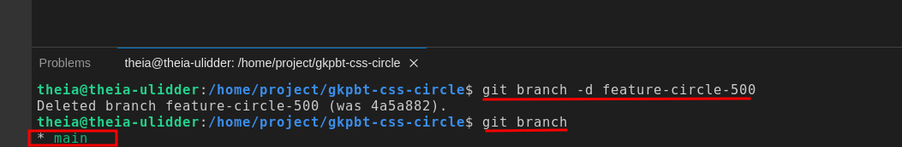

# Exercise 10: Push your changes to origin

This push will synchronize all the changes you made on your local system with your fork repository on GitHub.

To push your update to GitHub, ocmplete the following steps:

1. In the Terminal window, run the following command:
```
git push origin main
```

Once you submit that command, Cloud IDE will display a dialog in the lower right corner, requesting permission to sign in using GitHub. Click "Allow"

> Note: If you don't see the dialog box below, you will be asked to enter your Github username and password in the terminal. Your PAT (Personal Access Token) will be hidden when you tyep or paste it in the terminal for security reasons. So, make sure you enter or paste it correctly before hiiting 'Enter'.

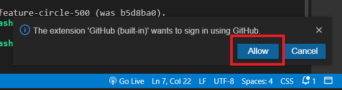

> Note: If you come across a messge like the one in the screenshot below, which says "Sign in failed: Error: Invalid scheme theia", please ignore this error.

Subsequently, another dialog will appear at the top of the screen, prompting you enter your username and password. The username is your email you used to sign into GitHub and the password is the `Personal access token` you created in Execise 1 - THis is not you Github password

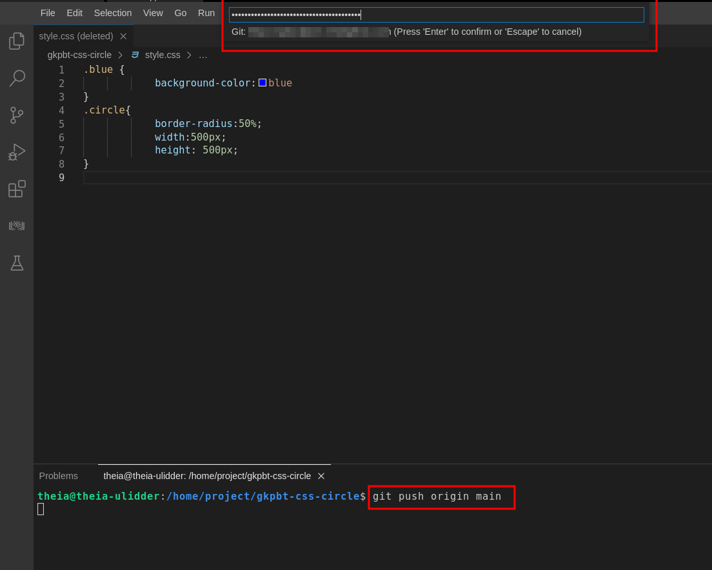

If your username and password were accepted, you should see the changes pushed to GitHub in the terminal.

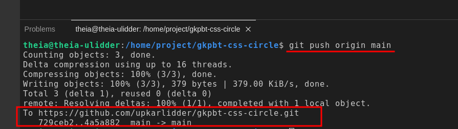

2. Go to the fork repository in your GitHub account and verify that the local changes have now been added to the main branch.

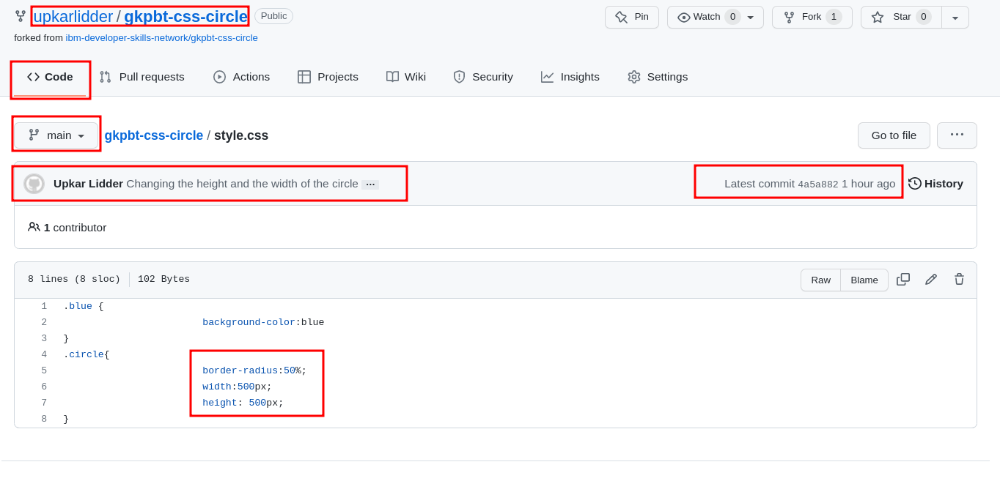

# Execise 11: Create a pull request

The final step is to request the original project pull in the changes you've made to your fork. To merge your changes to the original repository, you need to create a pull request. 

To create a pull request, complete the following steps:

1. Ensure you are on the Code tab, Click Contribute and then Open pull request. 

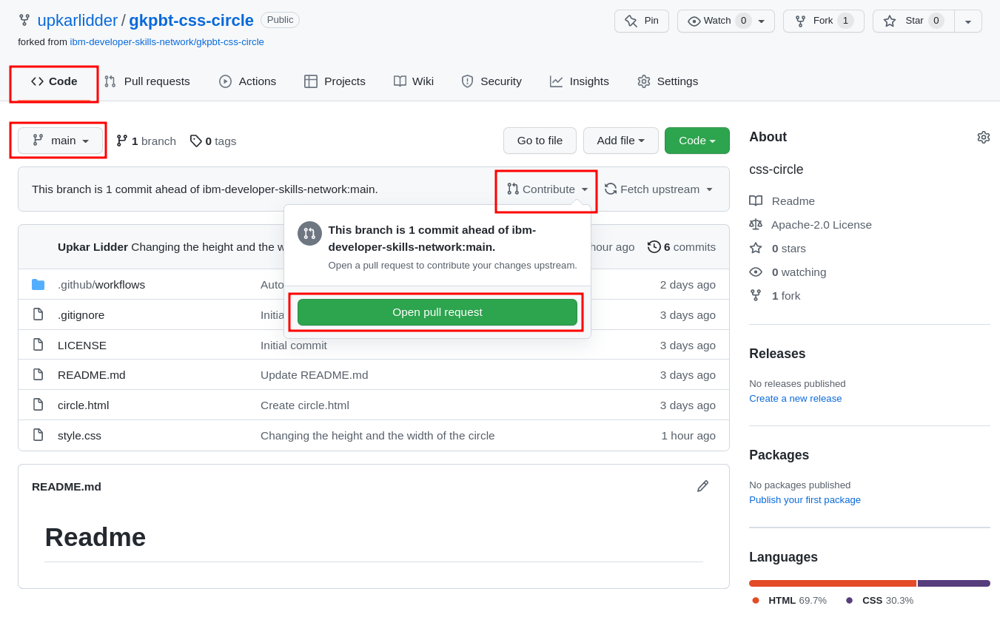

2. In the "Comparing changes" panel, GitHub shows you that it is comparing the main branch of your fork to that of the original repository, and that your changes can be merged. Click the Create pull request button 

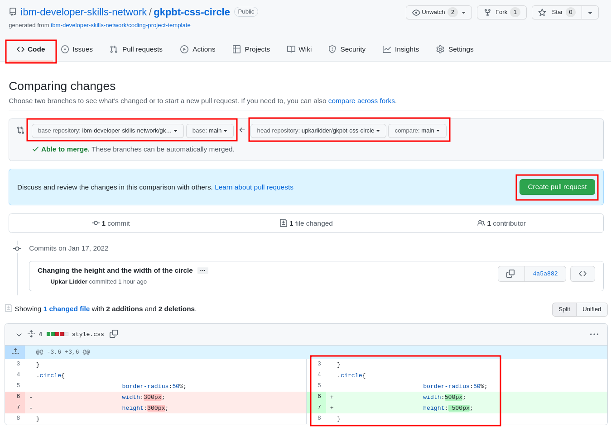

3. You are taken to the Open pull request screen. Notice that your commit message appears as the title of the pull request. Click the Create pull request button.

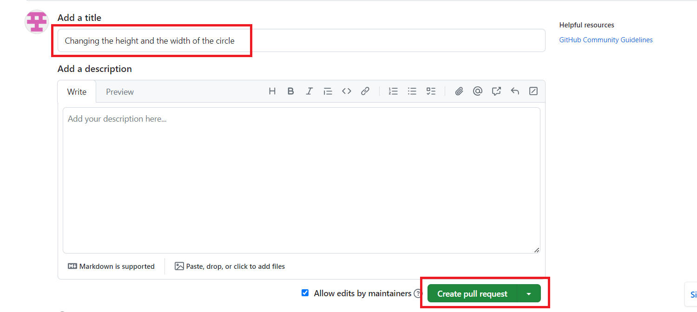

**Note** For the purposes of this lab, your pull request will be peocessed and closed automatically.

You should see the fllowing message in your pull request after a few minutes:

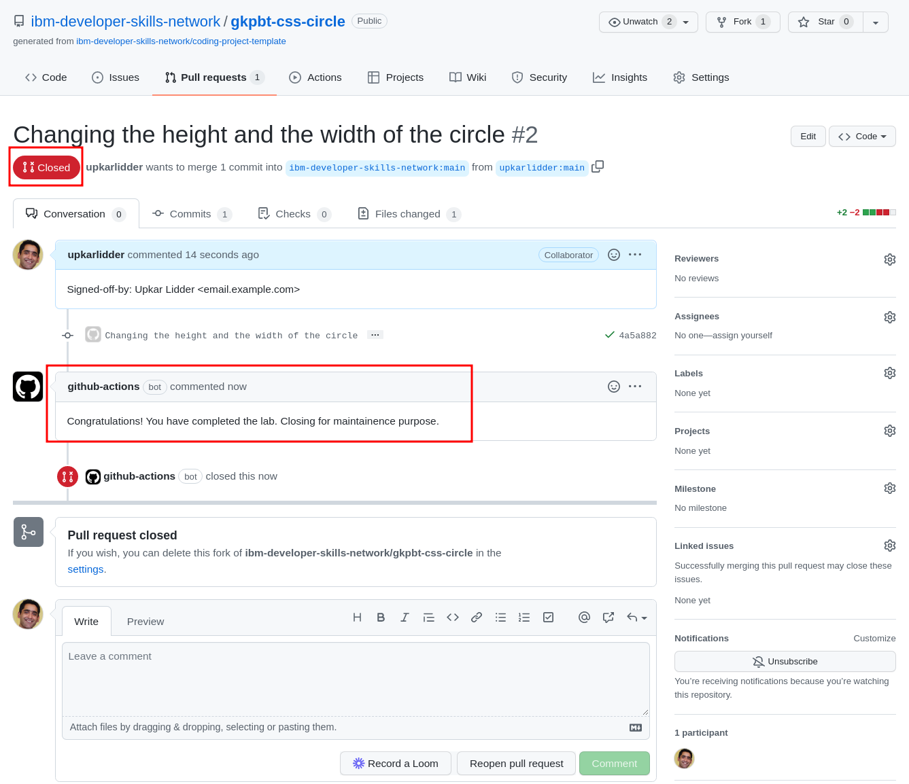

# Exercise 12: Practice on your own

1. Create a new branch called `feature-add-color`

    <details>
    <summary>Click here for Solution</summary>
    
    ```
    git branch feature-add-color
    ```
    
    </details >

2. Make `feature-add-color` the active branch.

    <details>
    <summary>Click here for Solution</summary>
   
    ```
    git checkout feature-add-color
    ```
    </details>

3. Add another css rule as follows:

```
.red {
    background-color:red
}
```

4. Stage this change

    <details>
    <summary>Click here for Solution</summary>

    ```
    git add -A
    ```

    </details>

5. Commit the changes in your `feature-add-color`
    <details>
    <summary>Click here for Solution</summary>

    ```
    git commit -m 'adding red color feature'
    ```

    </details>

6. Merge the changes in `feature-add-color` into `main`.

    <details>
    <summary>Click here for Solution</summary>

    ```
    git checkout main && git merge feature-add-color
    ```

    </details>

7. Delete the `feature-add-color` branch
    <details>
    <summary>Click here for Solution</summary>

    ```
    git branch -d feature-add-color
    ```
    </details>

8. Create a new pull request for this feature in the upstream repository using the GitHub UI

# Summary

In this lab, you have learned how to fork an upstream repository into your own account and then clon it locally in the lab environment. You then learned how to synchronize changes in your local repository with remote GitHub repositories using pull request. 
