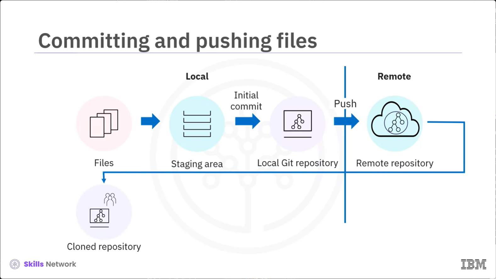

# Overview of Git Workflows

# What you will learn:
- Describe the steps in a Git workflow
- Explain the workflow in a real life scenario

# Scenario: Developing features for an e-commerce platform

Imagine yourself joining a team developing features for an e-commerce platform. You task is to add a product recommendation feature. 

The team uses git and GitHub for version control and collaboration. 

How will you collaborate effectively with the team using git and GitHub?

# Git workflows

 A clear understanding of git workflows ensures you can use git effectively for version control and collaboration. The knowledge will help you avoid issues such as code conflicts and unintentionally overriding a team member's work. 
 
 

# Cloning the remote repository

 The first step is cloning a repository that your team has hosted on GitHub.

Cloning creates a copy of the project's code, and its complete version history from the remote repository on your local computer. 

# Pushing and pulling changes

The connection established during cloning enables you to push code changes to the remote repository. You can also pull any changes from the remote repository to your local repository and update it.

# Implementing the feature

You can implement the product recommendation feature by updating the project files in your local repository.

# Creating a branch

As a developer, you might try multiple ways to code the feature. You may not want the changes to affect the main branch until the code is ready.

 A good practice is to create a branch from the main branch, and then work on the newly created branch. A branch in git is an isolated developemnt space based on the main branch where you can make changes. In this case, add a feature without interfering with the main code base.
 
 

# Committing files 

  After developing the feature, the next step is to select the changed files and move them to a staging area. The staging area is a temporaty storage space where you collect the selected files before asking git to save them in the local repository. You can now commit the files to the newly created branch. Committing files allows you to record the changes and ensure your new feature becomes a part of the branch. When you commit files, including a commit message provides context for you and your team members to understand the change.

  For example, include a commit message like implemented product recommendation feature.
  
   

# Pushing the changes to the remote repositoy

The next step is pushing the changes in the branch to the remote ropository.

   

# Reviewing code 

 Most often, the code is reviewed by a maintainer who is responsible for managing the repository before it is merged into the main branch in the remote repository.

To merge the branch, you create a pull request. It is a request to the maintainer to review and approve the changes in the branch. After the maintainer merges the pull request, the changes in the branch will be reflected in the mian branch. Similarly, if you have maintainer access, you will receive pull requests from your team members and you will review and approve their requests. 

You learned about the typical workflow in a software development project.

   

# Starting a new project
 
 There may be situations where you start a project from scratch and intend to collaborate with others. 

 You can initialize a local project directory as a git repository so that git starts tracking changes in your project directory.

# Commiting and pushing files

The next step is to select all project files that you want git to track, move them to a staging area, and then do an initial commit. After this, you will create a blank repository and link your local git repository to the remote repository. Then you will push all project files from your local repository to the remote repository. Other developers can clone the remote repository and follow the regular workflow for updating project files. 

# Scenario: Web application development

Let's understand the workflow better with a use case. A company assigns a team of developers, testes, and product manager to a new web application development project. 

Anne, the lead developer, initializes a git repository in her working directory. She screates project files, move them to the stanging area, and does the initial commit. She then pushes the commit to a blank remote repository she created. All developers clone the remote repository and start working on it by creating branches. 

# Web application: Featuere development 

One of the developers, John, is reponsible for implementing a user authentication feature. He creates a new branch named User Auth from the main branch. John completes the featuer development and commits to the User Auth branch. After thorought testing, he pushes the branch to the remote repository and creates a pull request. Anne reviews the pull request and approves it to merge the changes into the main branch so other developers can access the changes made by John. 

Similarly, other developers push commits to the remote repository for the features they worked on.

# Web application: Project release

At this stage, featuer development is complete and the project is ready to be released. Anne creates a release branch named Release 1.0 from the main branch in the remote repository. The team pulls the changes from the remote repository so that their local repository is up to date. They perform final testing, bug fixes and documentation updates in the Release 1.0 branch. After testing, they commit the changes, push the commits to the remote repository, and create a pull request. Ann reviews and merges teh changes into the main branch and tags the release as Release 1.0.

# Recap
When you join an existing project:
- Clone the remote repository, create a branch, and work on it. 
- Add files to the stagin area and commit to the branch. 
- Push commits to the remote repository. 
- Create a pull request to merge the branch into the main.
When you start a new project:
- Initialize a local Git repository.
- Move files to a staging area and perform an initial commit.
- Create a remote repository and link it to your local repository.
- Push the chagnes so other developers can clone the remote repository 