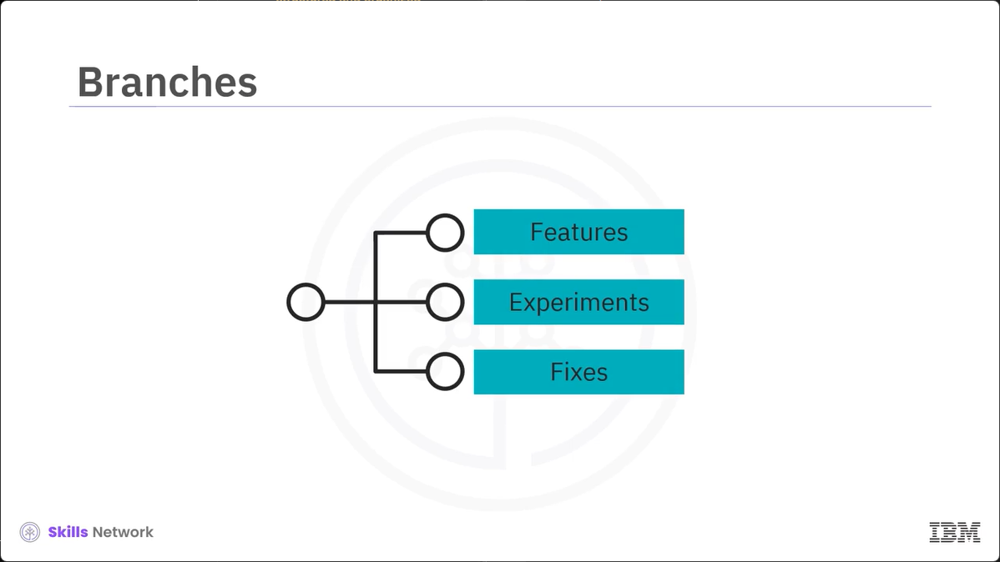
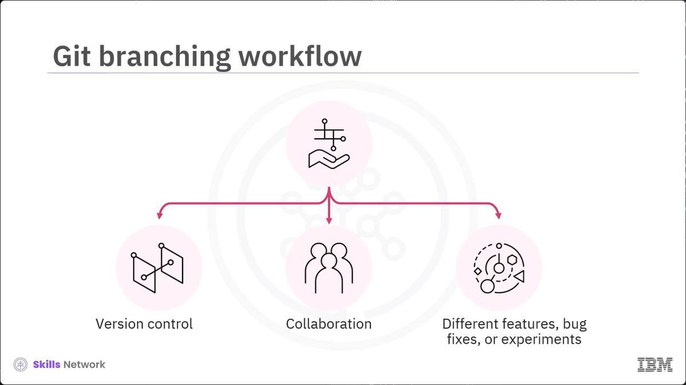
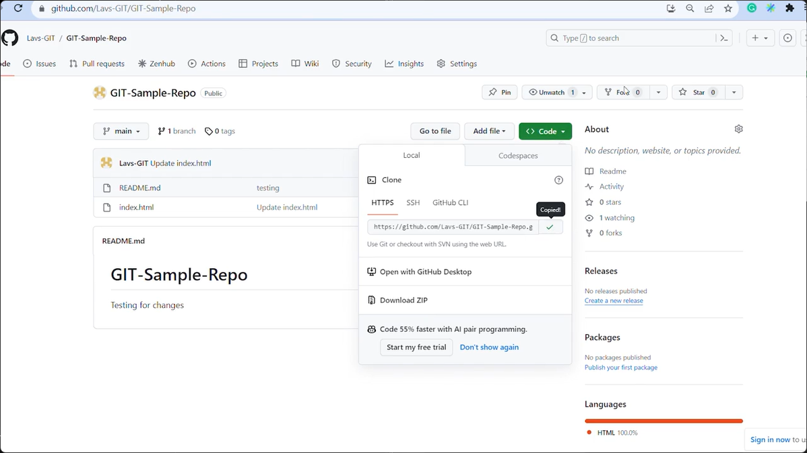
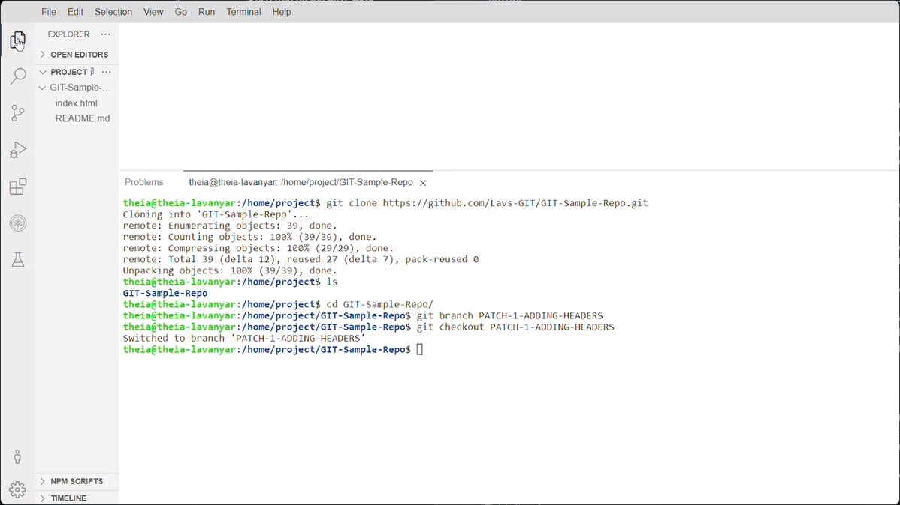
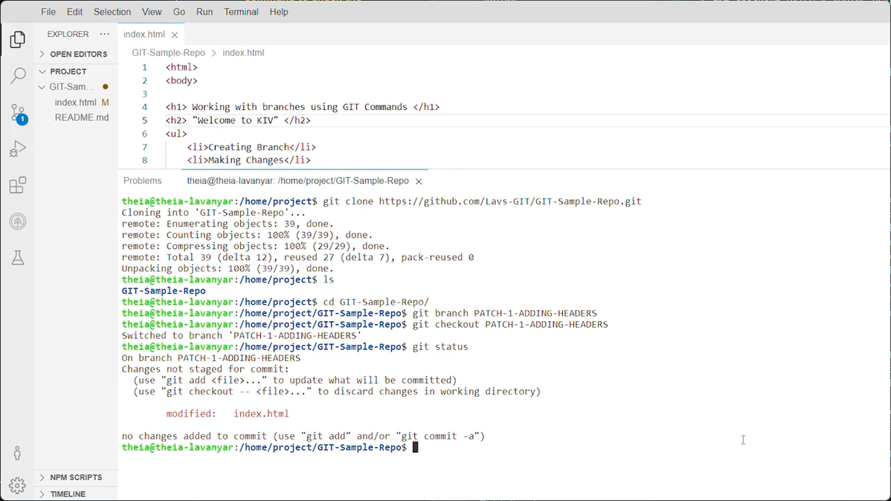

# Lesson 2.2.3 Demo Working with Branches using Git Commands

# What you will learn:

- Examine the functions of the various git commands

- Manage Git branches using Commands

# Branches

Branches allow you to work on features, experimetns, or fixes independently in a structured and organized manner. 


# Git branching workflow


The git branching workflow is crucial in version control and collaboration when working on software development projects. The workflow allows the teams to work on different features, bug fixes, or experiment in isolation without disrupting one another's code. 



Let us now focus on how to efficiently use git commands to facillitate the branching workflow process. 

To do so, first, let us clone the repository so that you can have a copy of that repository on your local machine.

Navigate to the GitHub repository, then click Code and copy the URL under the HTTPS section in the terminal window and change to the target directory. 



When you wnat to create a copy of the repository, run the git clone command with the repository URL.
```
git clone <https URLs>
```

 Once you have the copy, you can create branches, make changes, and sync those changes. Changed to the directory that was cloned Now let us focus on the git branch command. 

Run the git branch command, folowed by the desired branch name to create a new branch so that youo can work on it without impacting the main code. 

Let's say that to create a branch named PATCH-1-ADDING-HEADERS, you will execute git branch PATCH-1-ADDING-HEADERS. 

```
git branch PATCH-1-ADDING-HEADERS
```

The new branch created will be a copy of the branch you are currently on. Note that you will not be taken to the newly created branch automatically. To switch to branch PATCH-1-ADDING-HEADERS, user the git checkout PATCH-1-ADDING-HEADERS command. 


```
$ git checkout PATCH-1-ADDING-HEADERS
```


Now that you are on branch PATCH-1-ADDING-HEADERS you can make your changes.


 While on the PATCH-1-ADDING-HEADERS branch, let's say you add a header such as welcome to KIV to your index.html file. 
 

 Next, run the git status command to check the satus of your working directory.

```
git status
```

This will hightlight the modifications made to your index.html file. To stage the chagnes in your PATCH-1-ADDING-HEADERS branch, execute the git add index.html command. 
```
git add index.html
```


This command will specify  that the changes are now ready to be commmitted. You can finally run the git commit -m command with the message Added header to save your changes. 

Now the changes in the index.html file are part of your PATCH-1-ADDING-HEADERS branch's history. Let us now focus on mergin the PATCH-1-ADDING-HEADERS BRANCH with the main branch.

To do so, fisrtly, switch back to the main branch by running the git checkout main command.
```
git checkout mian
```

Now run the 
```
git merge PATCH-1-ADDING-HEADERS
```

 By doing so, you are no longer on the 
 PATCH-1-ADDING-HEADERS branch. Now run the git merge PATCH-1-ADDING-HEADERS command. 
 
 This command will integrate your changes from the PATCH-1-ADDING-HEADERS branch into the main branch.

 The header change from PATCH-1-ADDING-HEADERS` is now incorpoated into the index.html file located in the main branch. To make these changes accessible in your remote repository, user the git push -u origin main command.

```
$ git push -u origin main
```

This command will push the main  branch, icluding the changes merged from the PATCH-1-ADDING-HEADERS branch, to your remote repository. 

Finally, run the git status commadn to ensure the changes have been amde and the gbranch is up to date. 

# Summary

List branch
- git branch

Create branch PATCH-1-ADDING-HEADERS
- git branch PATCH-1-ADDING-HEADERS

Switch to a new branch and make changes
- git checkout PATCH-1-ADDING-HEADERS
- git status
- git add index.html
- git commit -m

Merge with the main branch
- git checkout main
- git  merge PATCH-1-ADDING-HEADERS.

Push the main branch to the remote repository. 
-git push -u origin main 