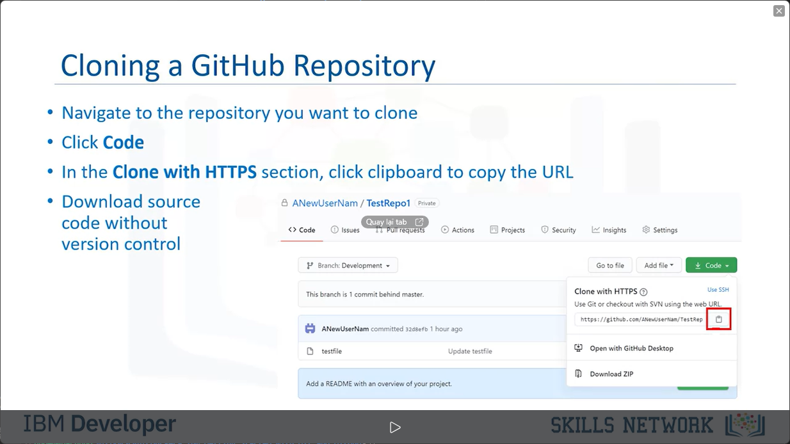
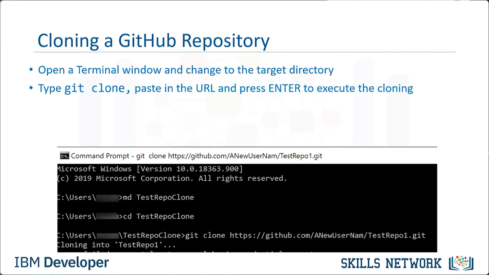
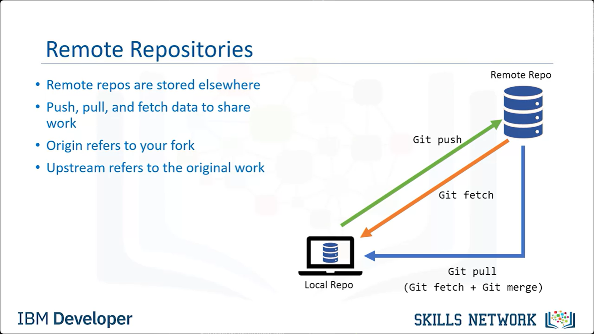
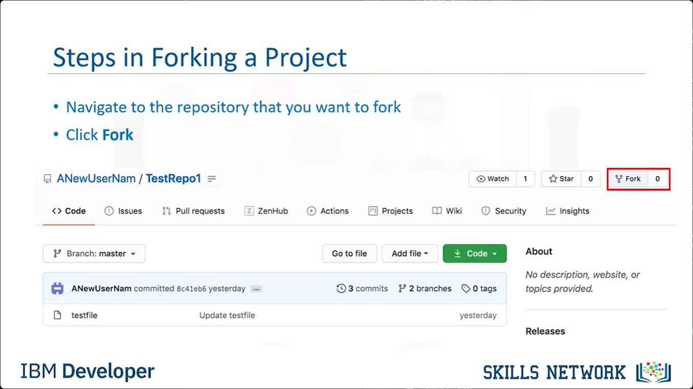

# Lesson 2.1.1 - Cloning and Forking GitHub Projects.

# Objectives

After watching this video, you will be able to:
- Clone and sync repositories
- Fork a project to make a base for a new project
- Use git commands to communicate with other developers.

# Team Working with GitHub

GitHub has over existing 100M repositories, including some very useful projects. 

Whether you are joining a team or basing your own project on prior work, some of the most powerful tools are forking and cloning a repository. 

Cloning generally refers to creating a copy of a repository on your local machine.

Cloned copies can be kept in sync between the two locations. 

Forking allows you to modify or extend a project without affecting the original project. 

Frequently, this is used to take an existing project and make it the starting point for your new project. 

- Over 100M existing repositories.

- Powerful tools include forking and cloning a repository
- Cloning creates a copy of a repository on your local machine
- Cloned copies can syns between locations
- Forking modifies or extends a project. 

# Cloning a GitHub Repository

To clone a GitHub repository, navigate to the repository that you want to clone. 

 Under the repository name, click Code in the Clone with HTTPS section, cilck the clipboard button to copy the URl to download the source code, you can click download zip, but without the version control information. 

- Navigate to the repository you want to clone

- Click Code
- In the Clone with HTTPS section, click clipboard to copy the URL
- Download source code without version control 

On your local machine, open a `Terminal` window and change to the direcctory where you want to clone to be copied. 

Type 'git clone' followed by pasting the URL that you copied above and then press ENTER to execute the cloning.

- Open a Terminal window and chagne to the target directory

- Type `git clone` paste in the URL and press ENTER to execute the cloning.

# Syncing Local Changes

 When you have made your changes and are ready to sync your code back to GitHub. First, you must run the `git add <files> ` command. This moves the changed files into a staging area on the GitHub repository.

 The stagin area is an area where commits can be formatted and reviewed before completing the commit .

 Next, when you are ready, run `git commit -m <message>` and this will commit changes in the staging area. 

 When you are ready to move your changes fully into the GitHub repository, Use the `git push` command. This will pushh all the commited changes into the repository.

 - To sync code back to GitHub
    - Run the `git add <file>` command
    - Changed files move to staging area
    - Next, run `git commit -m <message>` to commit changes in the staging area
- To move changes fully into the GitHub repository 
    - Use the `git push` command

# Remmote Repositories

Remote repositories are repositories that are stored elsewhere - on the internet, on your network, even on your local computer. 

You can have several of remote repositories, each of which generally is either read-only or read/write for you. 

Collaborating with others involves managing these remote  repositories and involves push, pull, and fetch operations to and from them when you need to share work. 

Use git push to transfer your changes to the remote repo. Use git fetch to transfer any changes from the remote repo to your local repo.

It does not merge those changes to the branch you are working on. 

You can perfomr a merge manually if you want. Use git pull to transfer any changes from the remote repo to your local repo, and merge them to a branch. Developers use the terms upstream adn origin when talking about remote repos.

Origin generally refers to your fork and upstream refers to the original work. These are the norms. You can of course name them anything you like. 

# Forking a Project

Forking is used to take a copy of a GitHub repository and use it as the base for a new project. You can also use forking to submit back changes into the original repository. 

This is also used to independently make changes to a project. In that instance, when you are satisfied with your changes, submit a pull request to the original project owner.

 They can decide whether or not to accept your changes. It is often a legal requirement to keep a copy of the of the license file. Even if no legal requirement exists, it's good practice. 
 
- Forking a Project
    - Takes a copy of a GitHub repository to use it as the base for a new project.
    - Submit changes back to the original repository

- Independently make changes to a project
    - Submit a pull request to the original project owner
    - Owner decides whether to accept updates
- Keep a copy of the license file
    - Often a legal requirement 

# Steps in Forking a Project

 Navigate to the repository that you want to fork. In the top-right corner, click the "Fork" button.
 
 

# Syncing a Fork of a Project

To keep a fork in sync with the original work from a local clone. 

First, create a local clone of the project. To configure Git to sync your fork: Open a Terminal and changes to the directory containing the clone. Type `git remote -v` This gives you the remote repository. Type `git remote add upstream <clone directory>` that you used in creating your clone. 

Adding upstream adds the original repository as a new remote repository labelled upstream. If you type `git remote -v` you'll see the change reflected. 

To kepp a fork in sync with the original work from a local clone:
- Create a local clone of the project
- Configure Git to sync the fork:
    - Open a Terminal and change to the directory containing the clone
    - To access the remote repository, type `git remote -v`
    - Type `git remote` and `upstream <clone directory>`
    - To see the change, type `git remote -v`

# Commands for Managing Forks

Other commands of interest include `git fetch upstream branchs` and `git merge upstream/master` which merges changes into the master branch. You will also see `git pull upstream` used to fetch and merge the remote branch in the same step. 

`Git pull upstream` reduces the number of steps to sync with a remote branch, but the automatic merges are not always desired. 

- To grab upstream branches
    - `git fetch upstream`

- To merge changes into the master branch
    - `git merge upstream/master`

# Summary
- GitHub has over existing 100M repositories
- Clone a repository to copy it locally
    - Sync changes back to the original
- Fork a repository
