# Lesson 2.1.5 - Cloning versus Forking

# What you will learn
- Compare forking and clonging repositories
- Identify when to use cloning and forking 
- Describe the cloning and forking worklow

# GitHub repositories

GitHub allows multiple developers to collabrate on their code base in parallel. A project in GitHub.com resides either as a public or private repository. Each developer working on that project may have their own copy of the repository on their computer which they refer to as their local repo and one that is on GitHub.com which they refer to as the remote repo. 

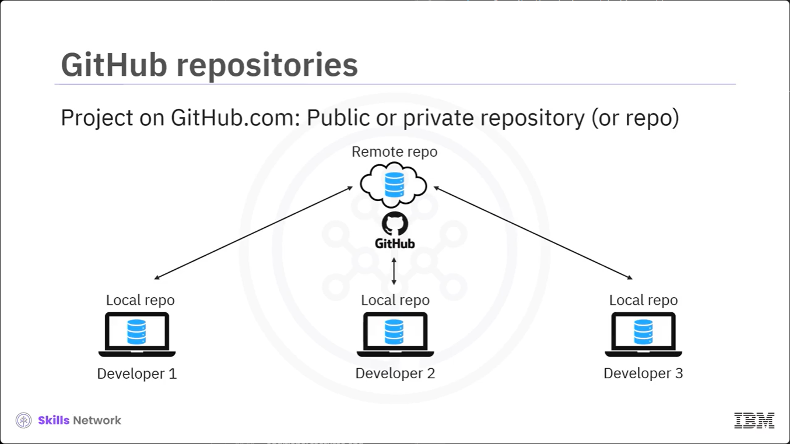

# When to fork?

Let's say you have an existing project named Grand Messaging,  and you are looking to create a new or derivative project Brand Messaging Plus, which offers additional features and improvements over the original. 
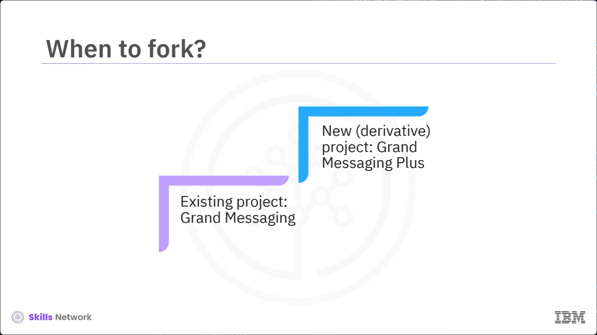

There's no need for you to start creating your code base again, you can simply fork the existing Grand Messagin project, create Grand Messaging Plus, and develop on top of the existing code base, offering new and improved features. 

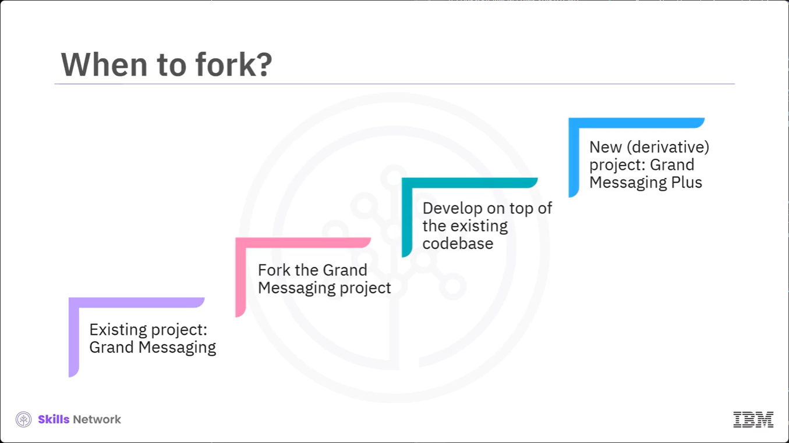

# Fork

To fork a public project, you can go to its GitHub project page and select Fork at the top of the page. 

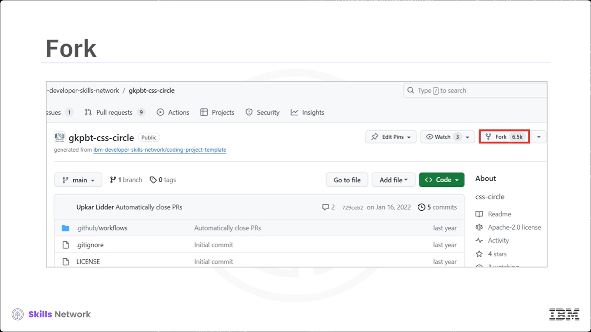

This fork option is available only while using the web interface. There is no native git command to create a fork. The repo from which you create the fork is referred to as the original upstream repository. Once you fork the original upstream, the forked copy of the repo becomes the origin, and developers with access to the origin can create clones of it on their local machines. After cloning, you can create branches and easily make changes to the code base, like adding features, enhancements, or fixing bugs. Finally, you can add commit, and push your changes to the branch and request to merge the branch with the main branch in the origin. 

However, it is important to note that the synchronization of changes using push and merge can only be done with repos that the developers have right access to. But what if you want to contribute your changes back to the original upstream that you do not have right access to from where it was forked? 

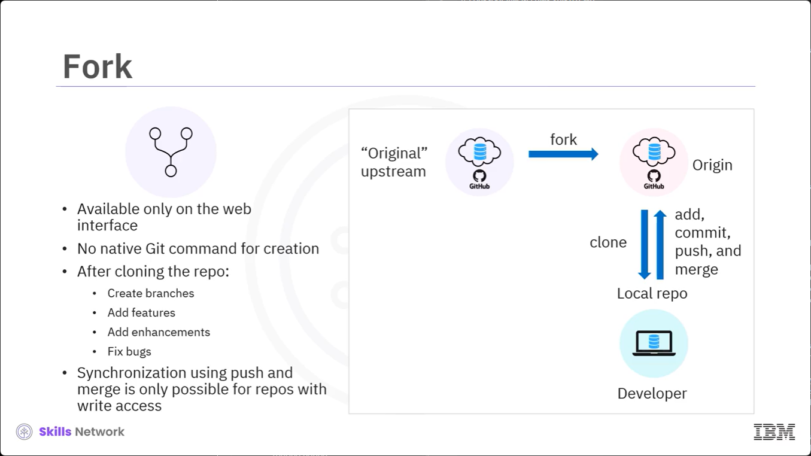
- Available only on the web interface
- No native Git command for creation
- After cloning the repo:
    - Create branches
    - Add features
    - Add enhancements
    - Fix bugs
- Synchronization using push and merge is only possible for repos with wirte access 

# Pull request

In that case, you can submit a pull request for your proposed changes by selecting New pull request form the Pull request tab. The maintainers of the upstream project can review the changes in the pull request, provide feedback, and merge accordingly unless there are any conflicts to be resolved.

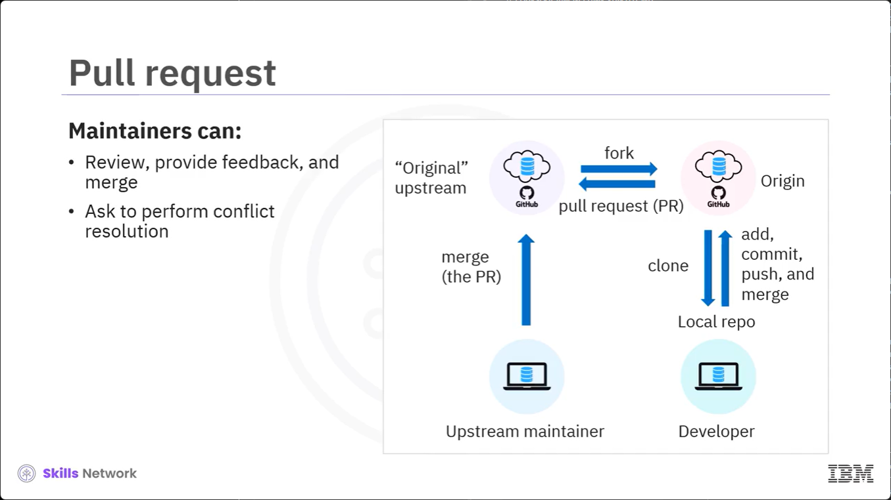

# Create branches and synchronize changes 

 Now, let's look at how you can create branches and synchronize changes. To create a branch, you can use The git branch command and then make the branch active using the git checkout command. Once changes are made, save and stage them using git add and git commit. After the intended changes are completed, you should set up an upstream branch for newly created branch and push the changes to the new branch, then you raise a request to the maintainter to merge the changes in the new branch to the main branch after reviewing it.
 
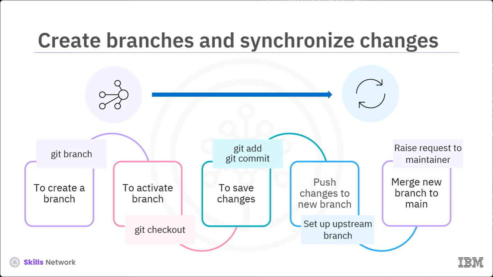

# Fork workflow 

Let us revisit the forking worflow. First, you create a fork of an upstream project which then becomes the origin. The developer can create clones on the local machines, make changes, and then use git push to push the udpated main branch back to the origin by creating pull requests. The upstream project maintainers review the changes and then merge if there are no conflicts. 

One things to ntoe about the git merge command is that it lets you take independent lines of development in git branches and intergrate them into a single branch.

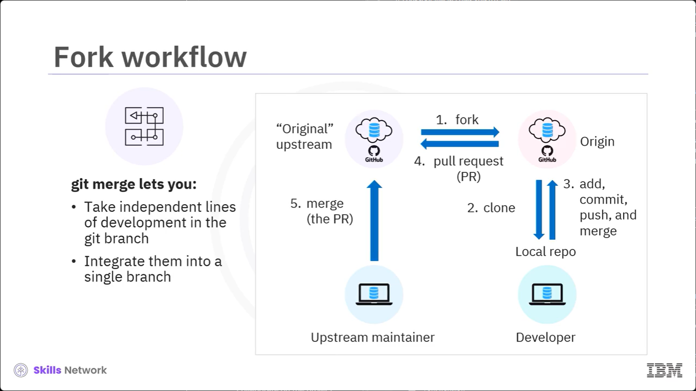

# Git clone 

 Now, let's say a new developer joins your project to upgrade the Grand Messaging to Brand Messaging Plus. How are you going to share the remote repo with the new developer to collaborate on the project? This is where cloning comes to your rescue.
 
 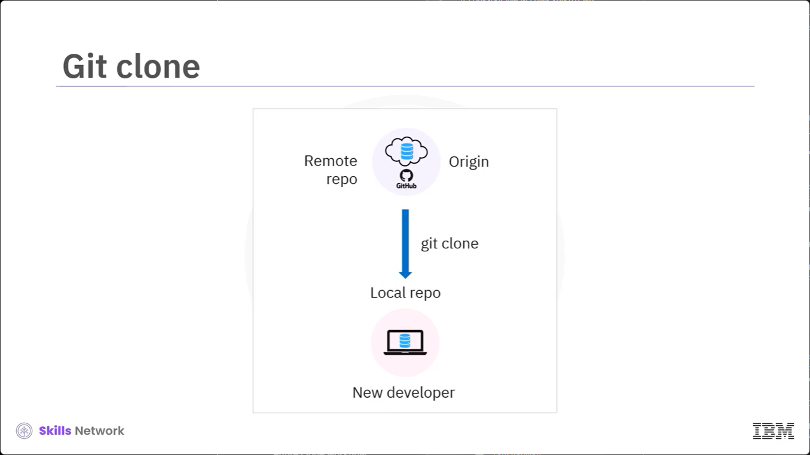
# Clone 
  You can clone any public repo in GitHub or a private repo that you have access to by going to that repo and selecting the Code button You can then get the entire code base of the remote repo in various ways. GitHub also gives you the ability to copy the HTTPS URL and then execute the git clone URL command from you local machine. 
 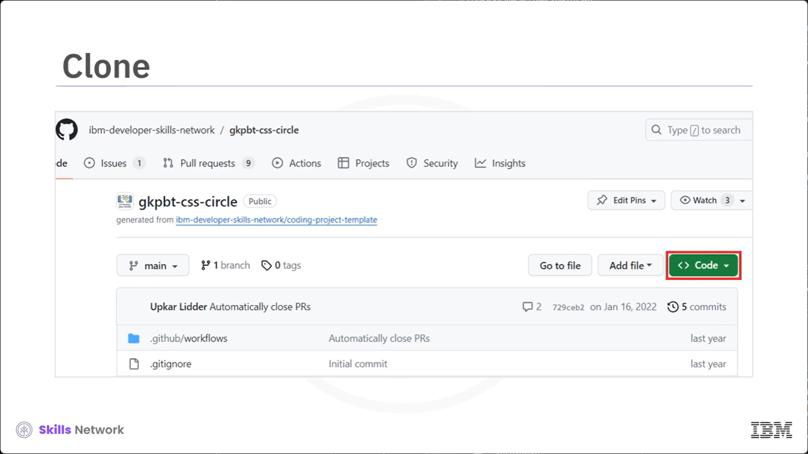
 
 # Create branches and synchronize changes

 After cloning, you can follow the same process of updating your cade base and mergin with the main branch. 
 
 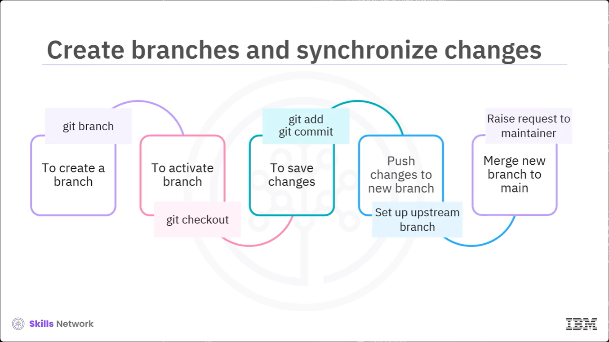
 
 # Clone workflow 

 Let us quickly look at the entire clone workflow. Cloning comes into the picture once you have forked your repo and it has now become the origin. You then use the origin to create an identical copy of the remote repo using the git clone command that the deveoper can use on their computer. 

 Then, the new developer creates a new branch, makes changes, annd saves them using add and commit operations. After that, they push the new branch to the origin to get their changes reviewed. A reviewer or maintainer uses the git fetch or git pull command to get the lastest copy of the repo and the git diff command to help identify and compare the changes in the branch. 

 Once reviewed, they can use git checkout and merge the branch to the main. Lastly, anyone with maintainer access can create a pull request to the original upstream to initiate the changes in the original repo. 

 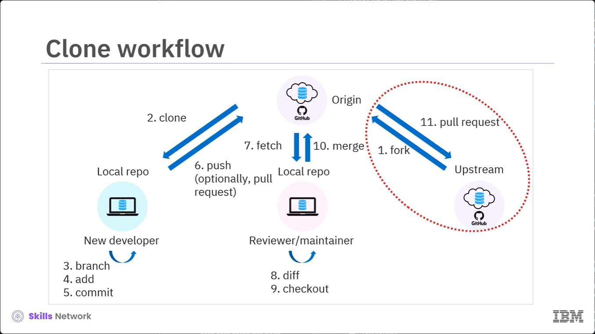

 # Summary

 - To create a derivative project with another project, you choose to fork a project. 
 - Submit a pull request (PR) to suggest changes back to the upstream project
 - Maintainers can:
    - Review, provide feedback, and merge
    - Ask to perform conflict resolution
- To create an identical copy of the remote repo, use git clone
- Remote repo, from which the project is originally cloned, is the origin
- To create branches and synchronize changes, use:
    - `git branch` to create a branch
    - `git checkout` to activate the branch
    - `git add` and `git commit` to save changes
    - `git push` to push the branch to the remote repo
    - `git merge` to merge the changes to the main branch.
