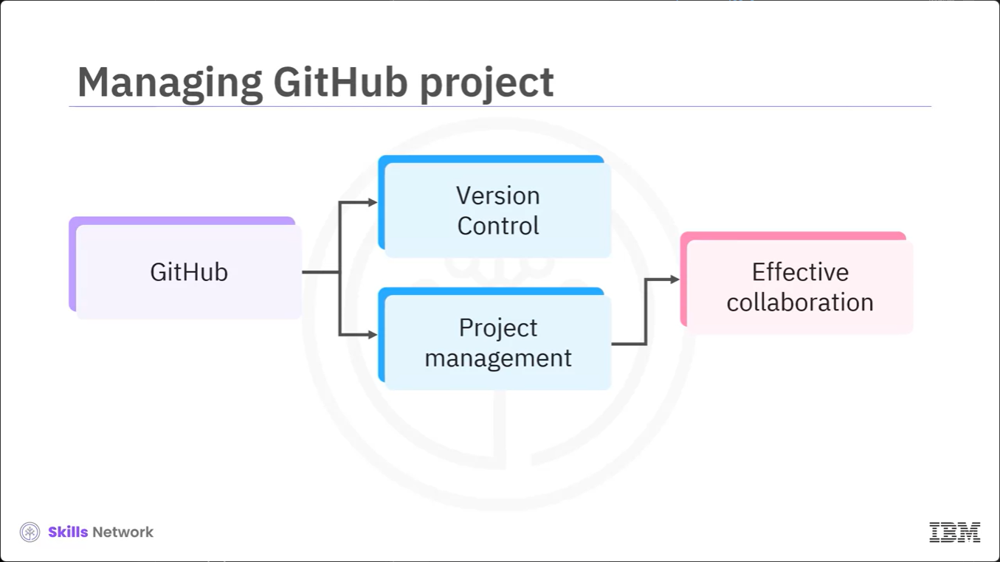
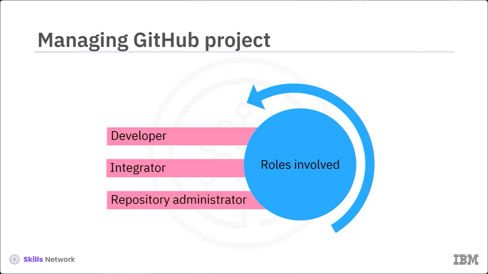
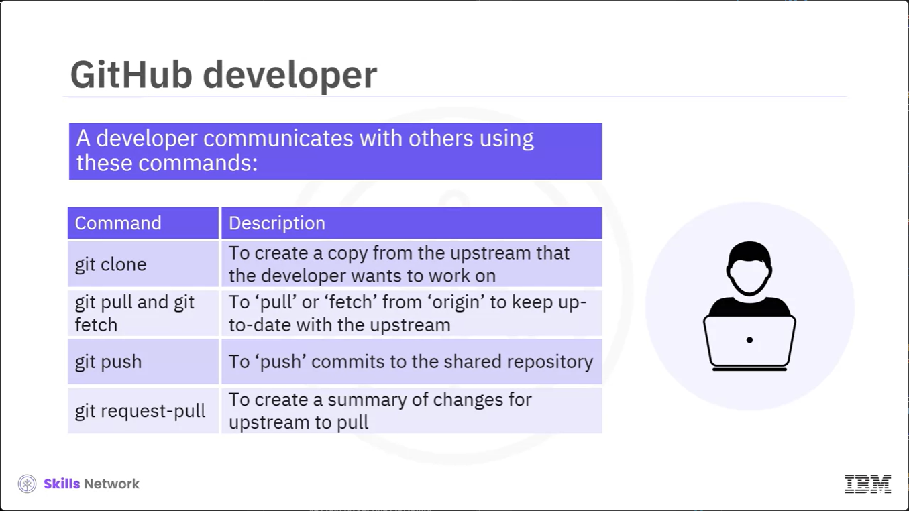
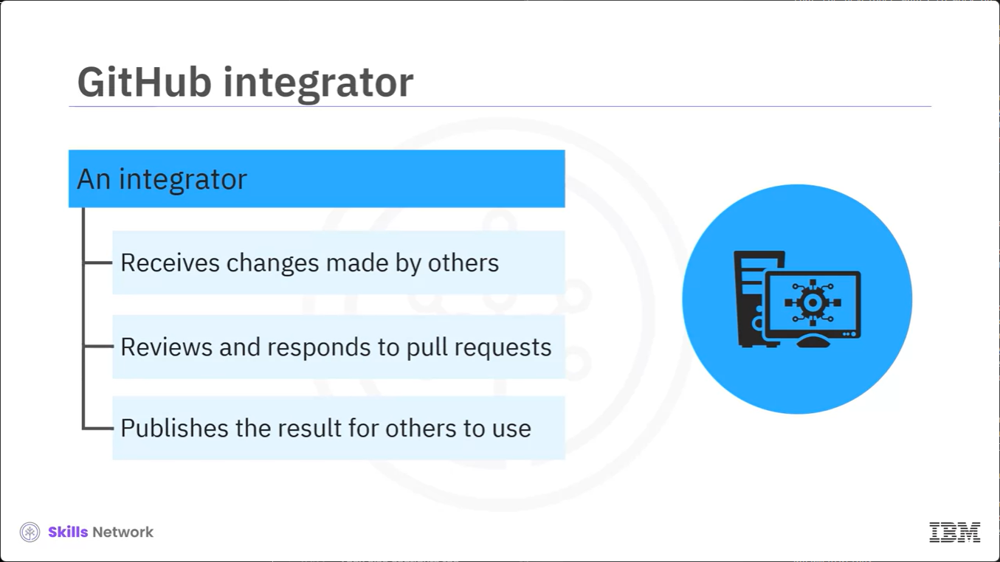
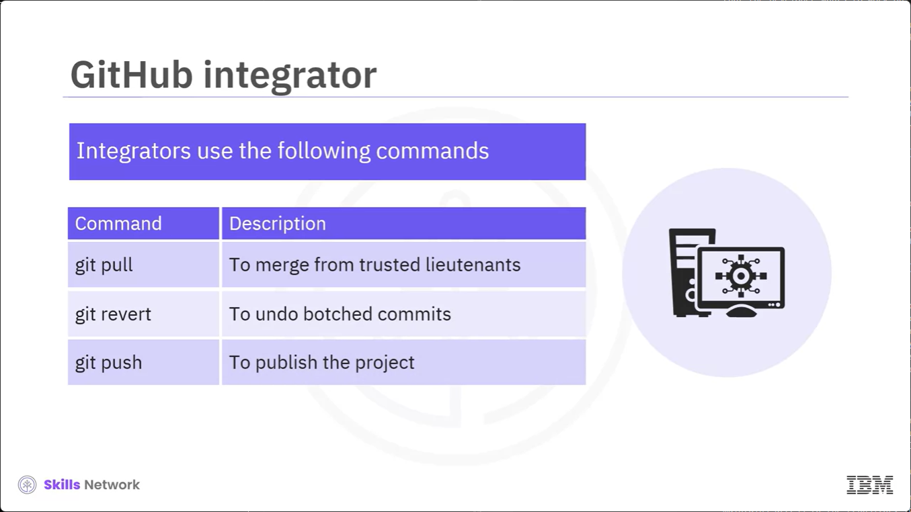
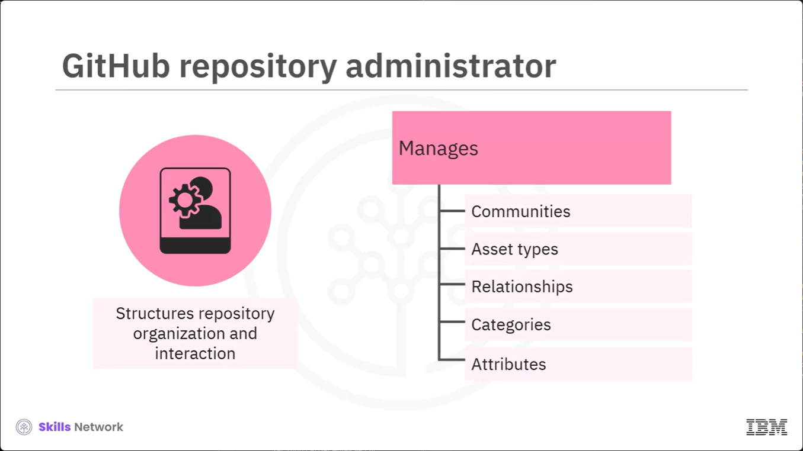
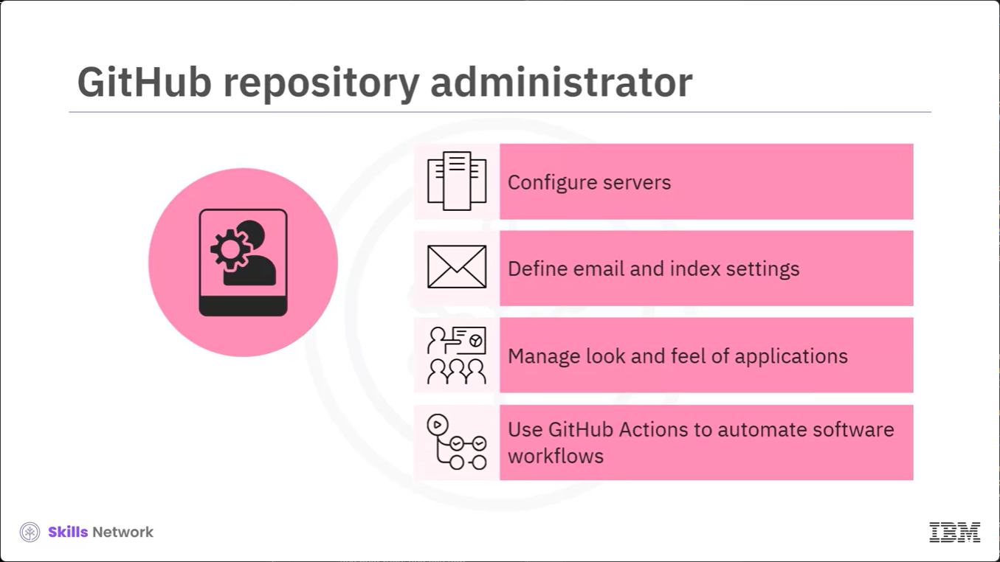

# Lesson 2.1.6 - Managin GitHub Project

# What you will learn
- Identify common roles of GIt in the project
- List Git commands to communicate with other developers

# Managing GitHub project

You already know that GitHub is a popular platform for version control and project management. You require managin your GitHub projects for effective collaboration and project organization.

# Managing GitHub project

 Multiple roles are involved in managing a project; a developer, an integrator, and a repository administrator.

# GitHub developer

A developer working as a participant in a group project needs to learn how to communicate with others and to use these commands in addition to the ones needed by a standalone developer. 

When working with Git, you can use Git commands or desktop tools such as GitHub Desktop. Git clone is used to create a copy from upstream, a remote shared repository that the developer wants to work on. 

Git pull and git fetch are used to pull or fetch the repository from origin to keep up to date with the upstream.

 Git push is used to push commits to the shared repository if you adopt a concurrent versioning system for the repository workflow, and git request pull creates a summary of changes for your upstream to pull.

# GitHub integrator

An integrator in a group project receives changes made by others, reviews and integrates them, responds to pull requests, and publishes the result for others to use. 

Integrators use the following commands in addition to the ones needed by participants. Git pull helps you merge with your trusted lieutenants. Git revert will undo any botched commits. Git push will help to publish the project from the local repo to the remote repo. 

# GitHub repository administrator

The repository administrator structures how the repository is organzied and how users interact with the repository. They also manage communities, asset types, relationships, categories and attributes.

A repository administrator sets up and maintains access to the repository for developers. They also configure the servers needed for accessing the web service and documentation, define email and index settings, and manage the look and feel of the application. Repository admins can use GitHub actions to automare software workflows including continous integration and continous delivery or CICd. 

# Summary
- Roles involed in project management: Developer, integration, and repository administrator
- Each role uses different git commands
- Developer uses git clone, git pull or git fetch, git push, and git request-pull
- Integrator
    - Reviews and integrates changes
    - Uses git pull, git revert, and git push
- Repository administrators
    - Structure repository orgranization and interaction
    - Configure servers
    - Define email and index settings
    - Manage look and feel of applications.
    