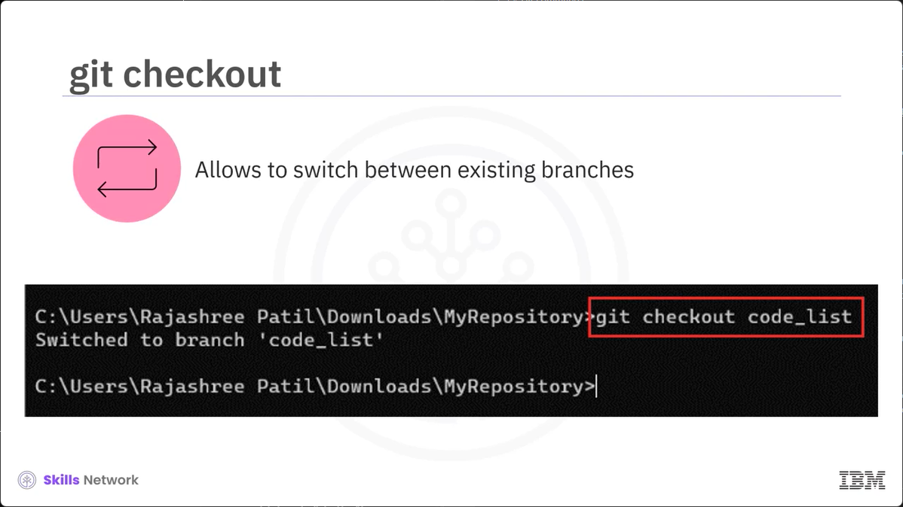

# Lesson 2.2.2 - Overview of Git Commands

# What you will learn
- Examine basic Git commands 

- Examnine the functions and applications of Git commands

# Git commands
- Git commands are used for various purposes such as tracking and saving changes and sharing your changes with others.

- Typically, many of these activities are performed through the web interface Command-line interface or CLI is another option to perform these activities.


# Commands

Let's consider a scenario to understand some general command-line commands such as mkdir, cd that can help in smooth functioning of the project.

We will also disscuss some basic Git commands such as git init, git add, git commit, git log, git branch, git checkout, git merge, git status. 


# Web development

Consider you are a part of a web developer who wants the addition of a new HTML file to enhance the features of his web application. In this scenario, you wish to experiment with your codes without disturbing the main code. Let's explore the steps.


# `mkdir`

 Let's start by creating a new directory named MyRepository by using the mkdir command. The mkdir command stands for make directory. 
 
 


 # `cd MyRepository`

 Once you have created the directory, navigate to the directory using cd MyRepository command.

 This command is used to navigate into a specific directory. 

 

 # `git init`
 
 Now, let us now create a new repository in this directory using the git init command. It sets up the necessary files and data structure for Git to start managing your project's version control. 
 
 

# `git add`

 You can create a new HTML file that has the necessary content. Let's say you create index.html file. Now, add this newly created file to the staging area usign git add command. 

 This command moves changes from the working directory to the staging area. 


# `git commit -m`

Now, you decide to commit the addition of the newe HTML file with a message. For this, you use the git commit -m command that takes your stage snapshot of changes and saves them to the project with a descriptive message. This message explains the purpose of the git commit. In this case, created a new HTML file can be your commit message. 


# `git log`

If you wish to review the commit history to confirm the commit is recorded, run the git log command. It enables you to browse previous changes made to a project. Here, your commit history will reflect created a new HTML file. 


# `git branch`

Now, what if you want to experiment with your code but you do not want to disrupt the current flow? Let's learn to create a branch using git branch command. 

To work in the isolation, you can use git branch command that lists, creates, renames, and even deletes branches within a Git repository.


 Say you want to create a branch called code_list. For this, you may use the git branch command. 
 
 ```
 $ git branch code_list
 ```
 # `git checkout`

 To switch to the newly created branch to start the development, use the git checkout command. 

 The git checkout command lets you switch between the existing branches.
 

# `git add`

  You can now make the changes to the index.html file in the code_list branch. Once done, run the git add changes to add the newly made changes in your file to the staging area. 

 

# `git commit -m`

As stated earlier, let's now commit the new changes made in the code_list branch with a descript message such as updated index.html file in branch. 

 

# `git log`

Let's now browse the commit log in the code_list branch using the git log command. Your output will now display updated index.html file in branch.

 

# `git status`

 To see the status of all the changes you made in your Git Working directory, let's run the git status command. This command Git provides information about the state of your files in relation to the repository. 
 


# `git merge`

 Finally git merge lets you put everything back together again and merge the feature branch with the main branch. In this example, we will use git checkout command to navigate to the main branch first. Then use the git merge followed by the branch name, which in this case is the code_list. 

 

# Recap

In this lesson, you learned that:
- mkdir: To create a new directory
- cd: To navigate to a specific directory
- git init: To initiate a Git repository 
- git add: To move the changes from the working directory to the stagin area
- git commit: To commit the changes to the project
- git log: To browse the previous changes
- git branch: To create a new branch
- git checkout: To switch between the existing branches
- git merge: To merge the branches with the master branch
- git status: To merge the branches with the master. 