# Overview

In this lab you will start your journey with the GitHub implementation for your organisaion by creating a repository in your GitHub account and then initialising the repository with a Readme.md file and a License. Following this, you'll update the README file to include a Code of Conduct and Contribution Guidelines markdown files. After making these chagnes, you'll commit the files to your repository.

Next, you'll create a new branch and add code for Shipping logistics calculation. To warp up, you'll merge this branch into the main branch using a Pull Request. 

# Objectives

After completing fis lab, you will have demonstrated that you can:
1. Create a repositoryy with a README.md file and a license.

2. Update the existing files. 

3.  Commit the files to your repository.

4. Create a new branch and add files to it.

5. Merge this branch to the main branch using a Pull Request.

# Task 1: Create  a repository with a README file and a license.

1. At the top right of the GitHub home page, click on the `+` icon and select `New repository`.

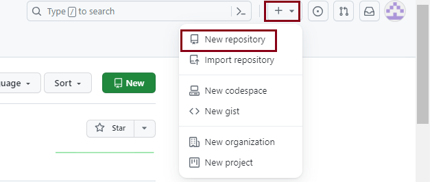

2. Create a new GitHub repostiroy called `LogisticShippingRates` and make sure that it is **Public**.

3. Select the Add a README file field. Click on the Choose a license filed and select `Apache License 2.0` from the drop down. Finally, click on **Create repository**

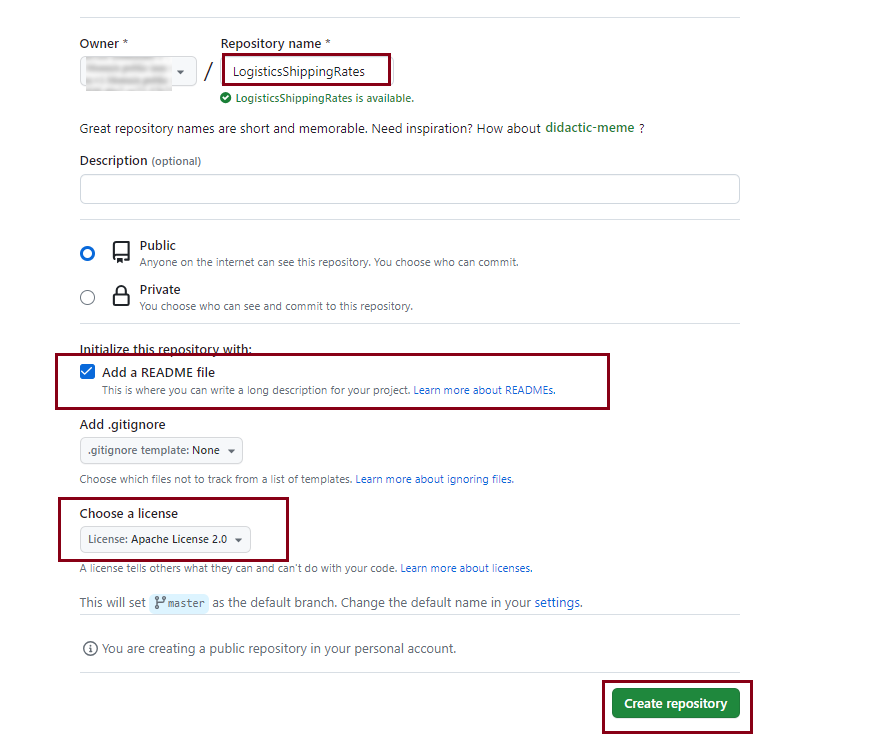

4. After successfully creating a new repo, you will see the following screenshot.

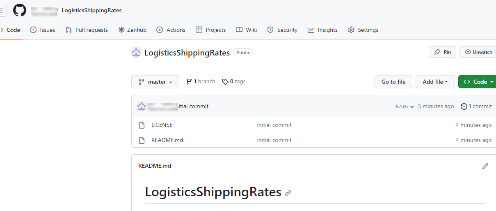

Your repository is created and includes the README and LICENSE files. Now, you are ready to update your repository files to include useful information for your community.

# Task 2: Update the README file.

1. Click on `README.md` file to open it and click the pencil icon to edit it.

 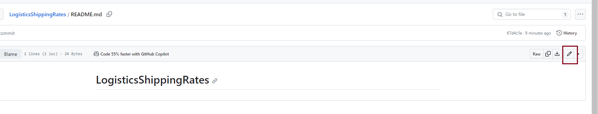

2. Adding the following information to the file:

```
Please consider the below factors while contributing 

Code Style:
Maintain a consistent code style for readability.

Documentation:
Ensure well-documented code for effective collaboration

Testing:
Thoroughly test your changes before sumitting a pull request.

Issue Tracker:
Check the Issue Tracker for tasks.

Code Review:
All contributions undergo a code review process.

Licensing:
Contributions are licensed. 
```

# 3. Now click on `Commit changes`

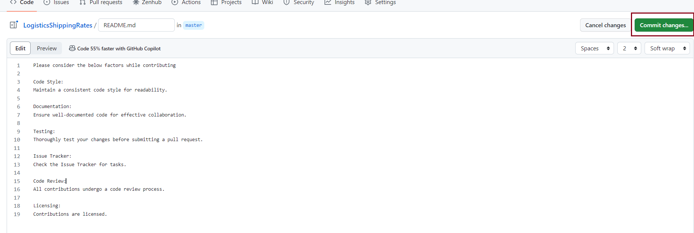

4. Ensure that the ratio button to **commit directly to the main/master branch is selected. Add a commit message and click on `Commit Changes`

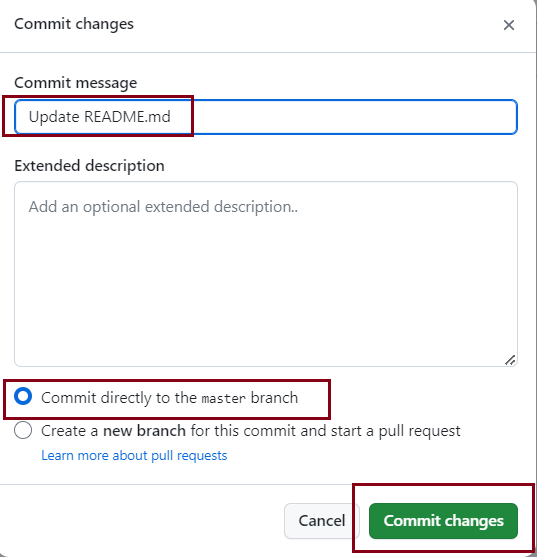

> Note: After completing the steps in each of the tasks, if you are unable to see the options depicted in the provided screenshots, click on the `Code` options as highlighted in below screenshot:

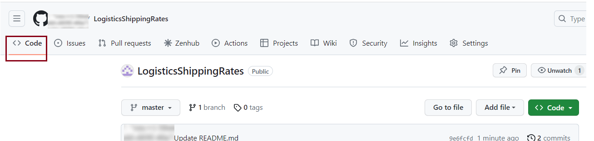

# Task 3: Add a code of conduct.

A code of conduct helps set ground rules for the behavior of your project's participants. It defines standards for how to engage in a community.

GitHub provides templates for common codes of conduct to help you quicly add one to your project.

1. To create a new file click on **Add file** and then `Create New File`
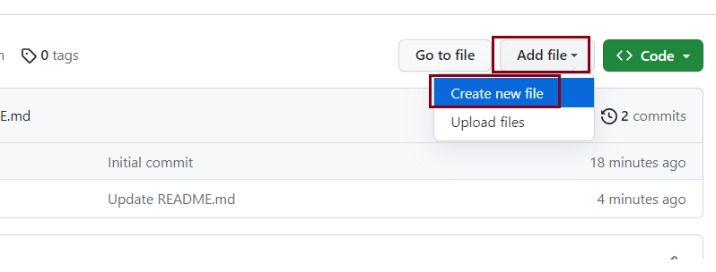

2. Add a new file named `CODE_OF_CONDUCT.MD` to the root folder of the repository. The **Choose a code of conduct template** button is displayed.
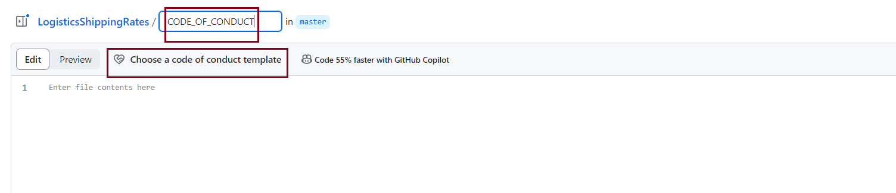

3. Click the **Choose a code of conduct template** button. You will see a popup mentioning you may lose unsaved changes. Click on `OK`.
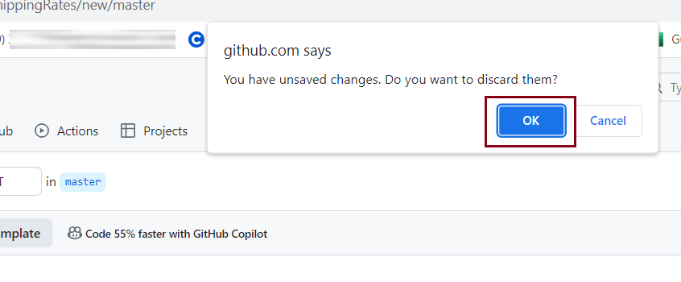

4. Click on `Contributor Covenant` to load this template . Then click `Review and submit` to add the file to your project. 
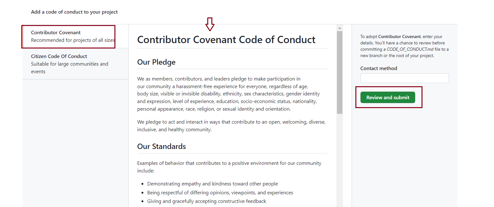

5. Scroll down the page to read the content. Click on `Commit changes`
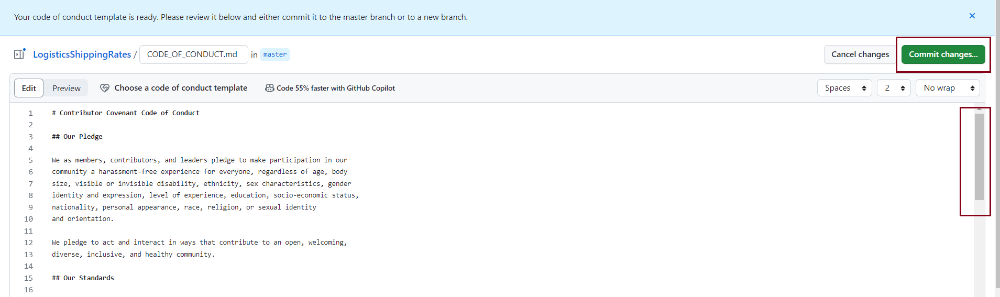

6. Ensure that the radio button to **Commit directly to the main/master branch** is selected and click `Commit changes`

> Note: In the past the default branch in your GitHub repo used the name `master`. Effective Oct 1.2020, all new GitHub repositories use the more inclusive term `main` as the name of the default branch instead of `master`

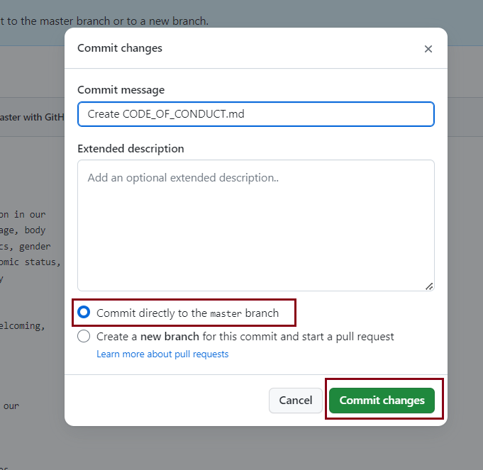

> If the page is zoomed in, you may see only the **Commit changes** button and not the radio button. Zoom out or scroll down to see the radio button.

7. Your project now contains a code of conduct. 

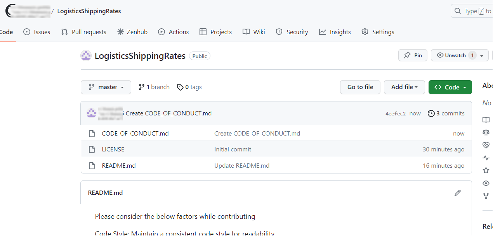

# Task 4: Establish contribution duidelines.

Contribution guidelines provide clear instructions for individuals looking to contribute to the project. To implement these guidelines, please follow these steps:

1.  Create a new file in the repostiroy's root directory and name it `CONTRIBUTTING.md`

2. Inside the file, include the following information:
```
Contribution guidelines
Welcome Contributors!
Thank you for considering contributing to the centralized repository. This document outlines for contributing to the development for Shipping Rates and Calculations.

Code style
Please follow the coding style and conventions used in the existing codebase. This helps maintain consistency across the project.

Documentation
Ensure that your contributions are well-documented. Include comments in your code where necessary and provide a clear and concise descripton of your changes in the pull request.

Testing
Before submitting a pull request, make sure your changes have been tested thoroughly. Include relevant test cases and ensure that existing tests pass.

Issue tracker
Check the issue tracker for any open issues or feature requests. If you're working on something, please comment on the issue to let others know. 

Code review
All contributions will go through a code review process. Be open to feedack and be willing to make changes if necessary. Code reviews help maintain code quality and consistency.

Thank you for your contribution!
```

3. Commit this file to your repository.
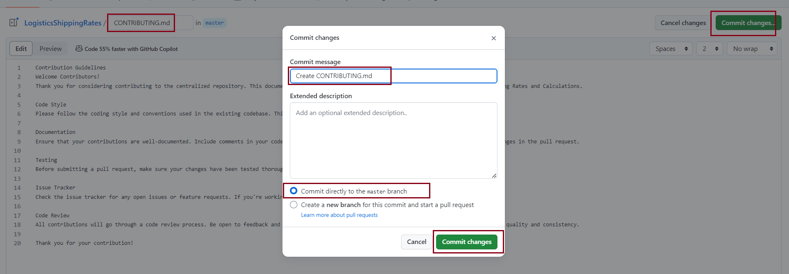

4. Click on `Code` to go to the repository home page.

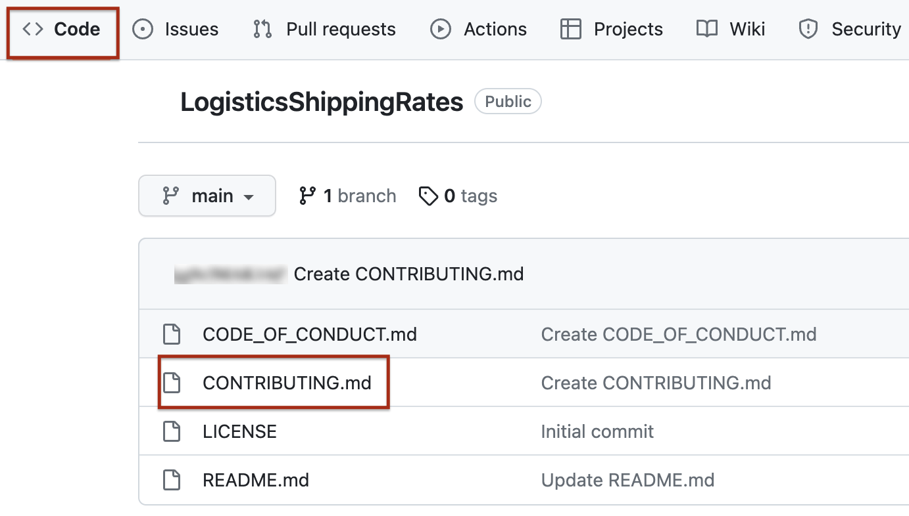

Your project now contains Contribution Guidelines as well.

# Task 5: Create a new branch

1. Click on `branch` in your repository
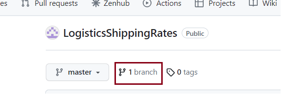

2. Now, click on `New Branch` and enter the branch name as `Shipping_Calcuation`, then click Create New Branch.
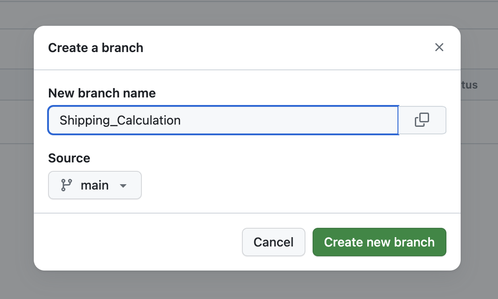
> This will be used for adding your Shipping Calculation code. 

# Task 6: Add the Shipping Calculation code in this branch.
1. Change to the `Shipping_Calculation` branch by selecting it from the dropdown.

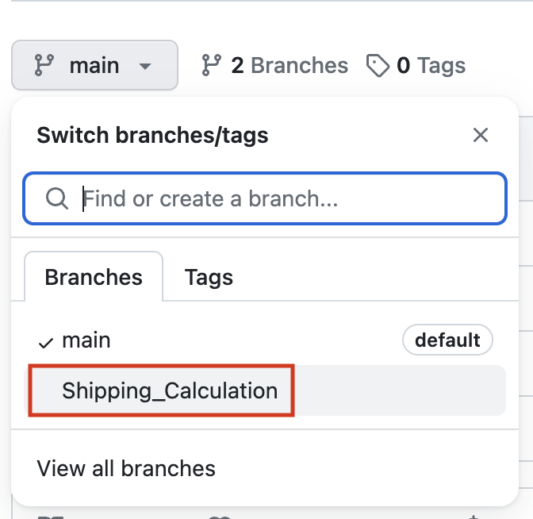

2. Create a new file named `Shipping_Cost_Calculator.py`

3. Add the following code in the new file:
```
# Shipping Cost Calculator

## Input package weight and shipping rate
weight = float(input("Enter the package weight in kilograms:"))
rate = float(input("Enter the shipping rate per kilogram"))

## Calculate shipping cost
shipping_cost = weight * rate

## Display the result
print(f"Shipping Cost: {Shipping_cost} USD")
```
4. Ensure that the radio button to **Commit directly to the Shipping_Calculation branch** is selected and click **Comimt changes**

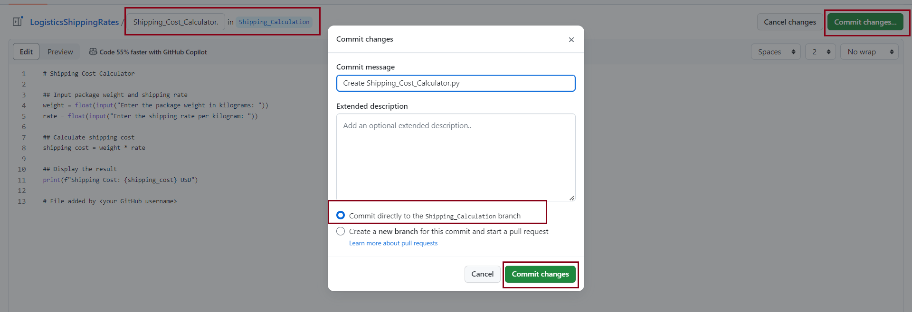

The `Shipping_Calculation` branch now contains the `Shipping_Cost_Calculator.py` file

# Task 7 : Create a pull request to the main branch

1. Go to the `Pull request` tab and click on `Compare & pull request`
 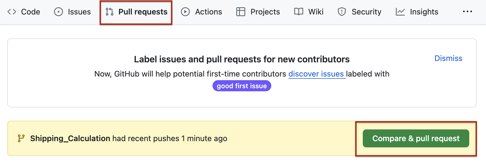

2. Add an appropiate commit message and click on `Create pull request`
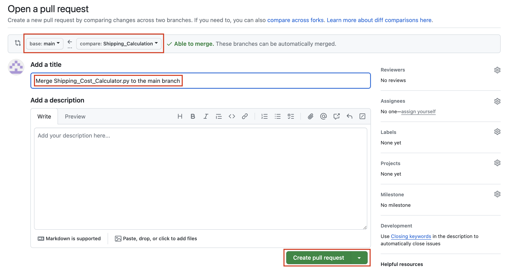

# Task 8: Merge the branch to the main branch.

1. Click on `Merge pull request`
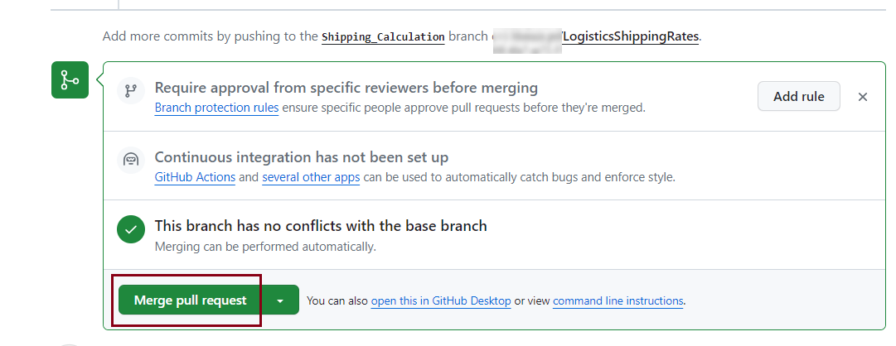

2. Click on `Confirm merge`

3. The successfully merged changes will be shown in the GitHub UI as below.
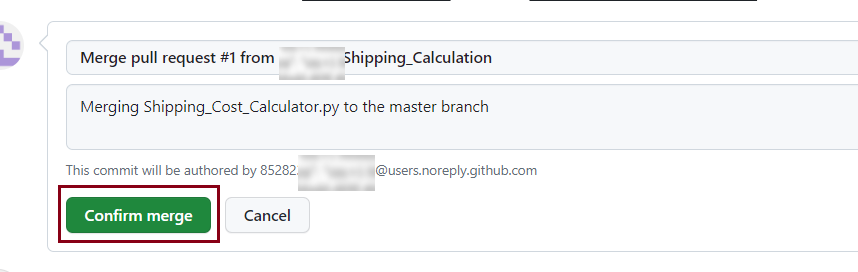

4. You will see the below message once the branch is merged
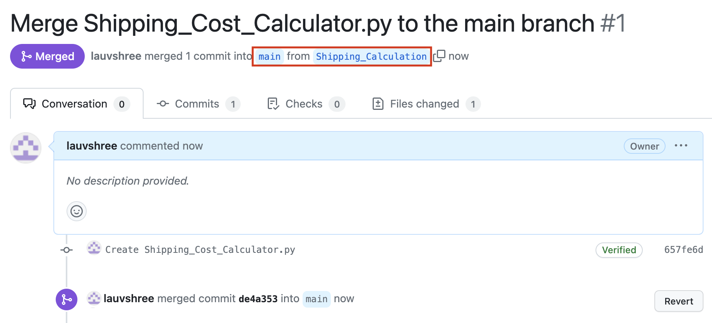

5. Check to see that your project now contains the `Shipping_Cost_Calculator.py` file as well.

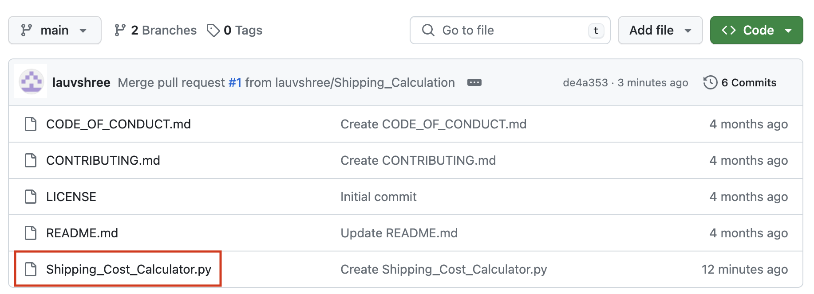


# Congratulation

In this lab you have created a repository in your GitHub account with a README.md file and a License. You haave then edited the README file and added Code of Conduct, and Contribution Guidelines. Further, you have commited thse files to your repository. Finally, you have added the Shipping logistics calculator file to a new branch, and merged it to the main branch using a Pull Request.
