# Practice Project: Part 2 - Git CLI

# Overview

Congratulations on starting your company's journey with Git and GitHub by open-sourcing the Shipping Cost Calculator Python script. All the developers have contributed to the repository, and their changes have accepted and merged into a new global repository. Now, you have been asked to edit some of the code and also add few more files. For this, you will fork this repository, make the necessary edits, add files using Git CLI in the provided lab environment, and open a pull request. 

# Objectives

After completing this lab, you will be able to demonstrate that you can:

1. Fork the upstream repository into your own account.

2. Clone the code locally in the lab environment.

3. Create a branch in the repository

4. Merge the branch back into the `main` branch.

5. Create a pull request from the forked repository to the upstream repository.

6. Revert a change that you made earlier.

# Task 1: Fork the repository

1. Log in to GitHub and go to the [Central Repository](https://github.com/ibm-developer-skills-network/Centralized-repository-shipping_calculations)

2. Click on `Fork` to create a personal copy of a GitHub repository in your account. This allows you to make changes independently.

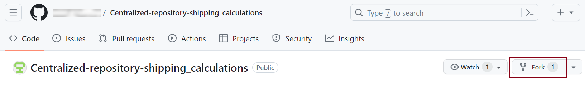

3. Now click on `Create Fork`

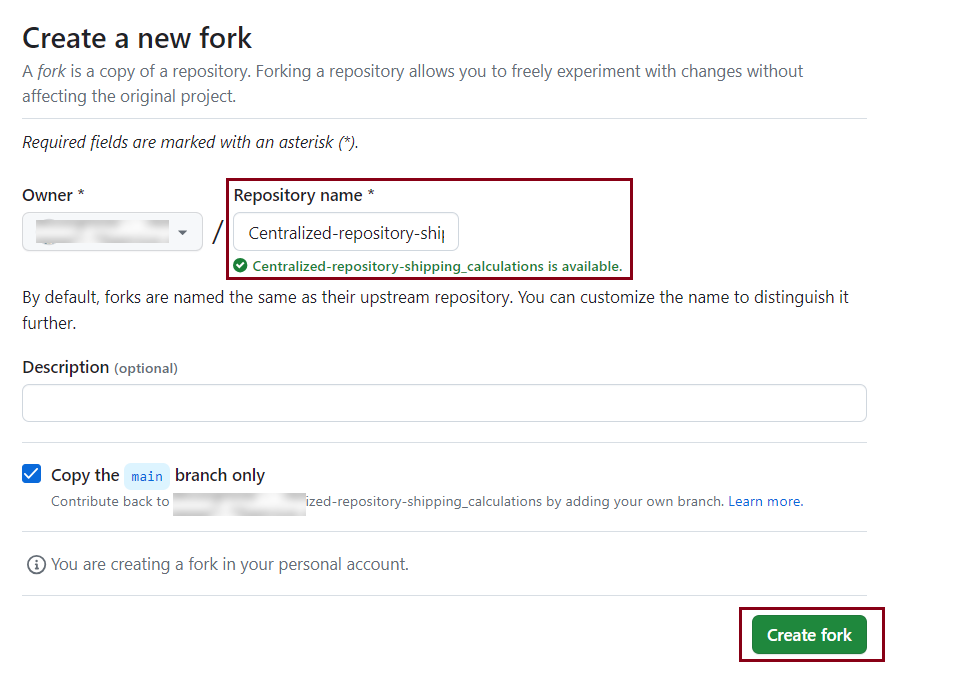

> NOTE: In real-life scenarios you will have the flexibility to change the repository name. However, in this Practice Project, it's recommended to keep the same repository name to ensure you complete the Project correctly and enhance your understanding.

# Task 2: Create a new branch and submit the first pull request

1. Open the terminal and clone your forked repository in the lab environment. Make sure to replace <your GitHub username> with your actual GitHub username.

```
git clone https://github.com/<your GitHub username>/Centralized-repository-shipping_calculations.git
```

2. Switch to the **Centralized-repository-shipping-calculations** directory by using the `cd` command

```
cd Centralized-repository-shipping_calculations
```

3. Create and switch to a new branch named **shipping_calculator_fixes** using the `git checkout -b` command.

```
git checkout -b shipping_calculator_fixes
```

Verify the current branch and view all branches with the command `git branch`

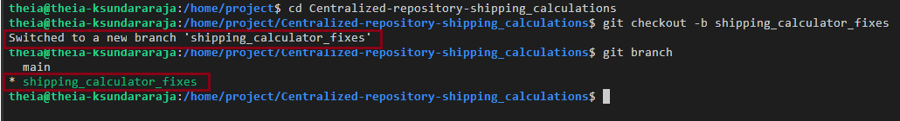

4. Insert the following line into the `Shipping_Cost_Calculator.py` file, replacing <your GitHub username> with your real GitHub username.

```
 # Here is a new update by <your GitHub username>
 ```

 5. To configure your Git user information, execute the given commands
 ```
 git config --global user.email "your-email@example.com"
```

```
git config --global user.name "Yourname"
```

> NOTE: Please ensure that you replace "your-email@example.com" with your actual GitHub email ID and "YourName" with your actual GitHub username.

6. Add and commit the code changes you have made, and check the commit status:
```
git add .
git commit -m "added a new line to Shipping_Cost_Calculator.py"
git status
```

`git add`: Stages changes made to Shipping_Cost_Calculation.py for the next commit.

`git commit`: git commit records the staged chagnes in Shipping_Cost_Calculator.py along with a specified message ('Added a new line to Shipping_Cost_Calculator.py')

`git status`: git status displays the current status and changes of Shipping_Cost_Calulator.py within the repository.

7. Use the command below to push the changes you made above in the lab environment or your local system IDE to the `shipping_calulator_fixes` branch in your GitHub repository, which is tracked as the upstream branch.
```
git push --set-upstream origin shipping_calculator_fixes
```

> `-set-upstream`:
> This flag is used to set up a tracking relationship between the local branch and the remote branch allowing you to use git push and git pull without specifying the remote branch every time.

> `origin`:
> This is the default name given to the remote repository from which originally cloned your local repository.

> `shipping_calculator_fixes`:
> This is the name of the local branch that you want to push to the origin (ie, remote) repository. It represetns the set of changes you have made locally and want to update on the remote server.

In the provided command, you're pushing the changes from the shipping_calculator_fixes branch (created in your lab environment or local system IDE) to the remote repository (`https://github.com/<your GitHub username>/Centralized-repository-shipping_calculations.git`) which you forked in Task 1.

The `--set-upstream` flag in the command establishes a tracking link between the *shipping_calculator_fixes* branch (in the lab environment or your local system) and the remote branch with the same name (shipping_calculator_fixes) in the origin repository. This streamlines future operations by eliminating the requirement to explicitly mention the name of the remote branch (ie, shipping_calculator_fixes) every time you run `git pull` or `git push`.

<details>
<summary>Please follow the appropiate process, as mentioned here: </summary>

# Sceario 1: If you encounter the "Allow" prompt, kindly proceed with the following steps:

1. You will see the below pop-up in the Theita evironment . Click on `Allow`


> Please disregard this message as it is unrelated to the Git commands and has no impact on the process. 

2. At the top, you'll reveive a prompt. Enter your GitHub username and then press 'Enter'.


3. Another prompt will appear at the top. Enter your GitHub PAT(Personal Access Token) as password and then press `Enter`.

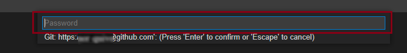

# Scenario 2: You will get the prompts in the terminal:

1. In the terminal, a prompt will appear. Enter your GitHub username and press `Enter`.
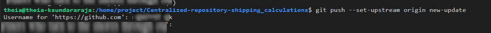

2. In the terminal, you'll receive another prompt. Enter your GitHub PAT (Personal Access Token) and press 'Enter'.
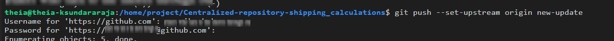
> When entering or pasting your PAT (Personal Access Token) in the terminal, the token won't be visible for secutity reasons. Therefore, ensure accurate entry or pasting before pressing 'Enter'.

This ensures the successful pushing of your changes to the remote origin repository.
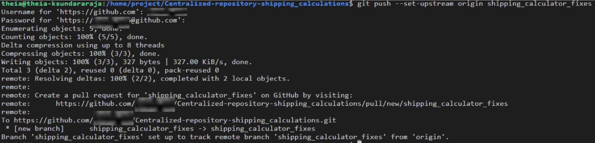


</details>

8. Generate and merge a pull request to incorporate the changes from the `shipping_caculator_fixes` branch into your `main` branch

> Note: in the past, the default branch in your GitHub repo used the name `master`. Effective Otx 1. 2020, all new GitHub repositories use the more inclusive term `main` as the name of the default branch instead of `master`.

Please refer to tasks 7 and 8 of [Practice Project Part 1](./Reading_3_1_2-Practice_Project-Part_1-GitHub_UI.md) to complete this process. 

<details>
<summary>Your pull request should look like the example shown here</summary>

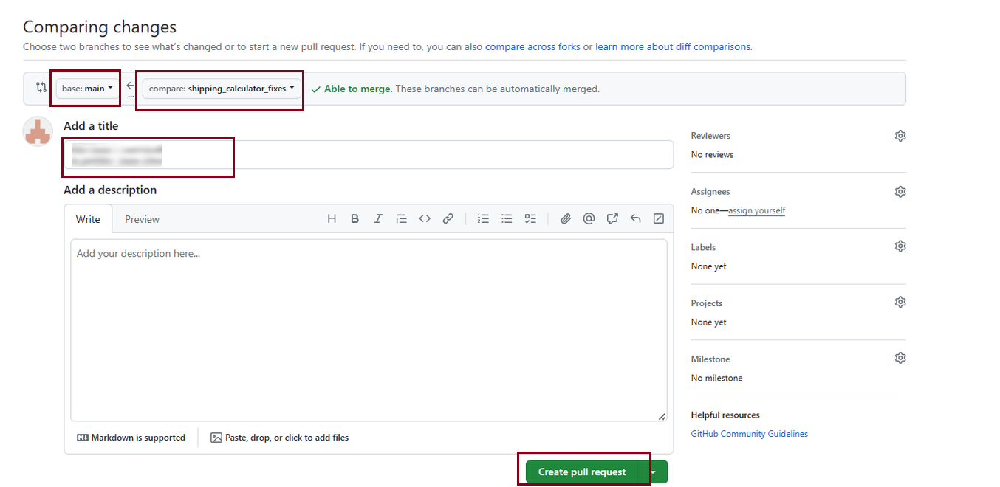
</details>

# Task 3: Commit another update and revert it

1. Add the following comment to the `Shipping_Cost_Calculator.py` file

```
# Here is another update by <your GitHub username>
```

2. Add and commit the new changes:

<details>
<summary>Click here to view the solution</summary>

```
git add .
```

```
git commit -m "added additional line to Shipping_Cost_Calculator.py"
```

</details>

**However, you now belive that this recently added line is unnecessary, and you can include it later.**

One method to achieve this is to remove the line you added, and then include and commit the changes again.

**Instead, you will now utilize the `git revert` command to accomplish the same functionality.**

3. Execute the `git revert` command as below.

```
git revert HEAD --no-edit
```

`git revert`: is a Git command used to undo a previous commit by creating a new commit that represents the inverse of the specified commit.

`HEAD`: This refers to the lastest commit in the current branch.

`--no-edit`: This option is used to perform the revert without opening the default text editor to edit the commit message. 

**After running this command, Git will automatically generate a commit message indicating that it's a revert and will create a new commit with the changes undone. The `no-edit` option prevents Git from opening an editor for you to modify the commit message; instead, it uses the default revert message. 

4. This will result in the following output:

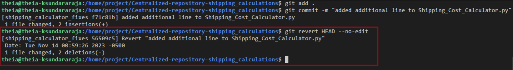

You will observe that the extra commit has been effectively undone. If you inspect the `Shipping_Calculator.py` file, the extra line you added will no longer be present.

Now, you are back to your initial commit and can proceed to push it to your repository.

5. Switch to the main branch using the `git checkout` command:

```
git checkout main
```

6. Execute the `git merge` command to push the udpates from the `shipping_calculator_fixes` branch into your `main` branch.

```
git merge shipping_calculator_fixes
```

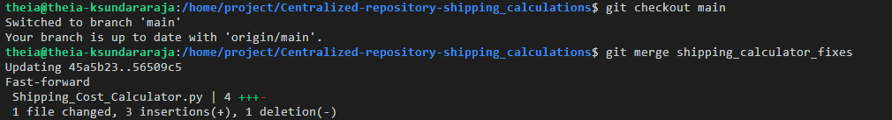

7. Run the `git log` command to obtain a chronological record of all commits. This will display information about the line that was added and subsequently undone through the `git revert` command.

```
git log
```

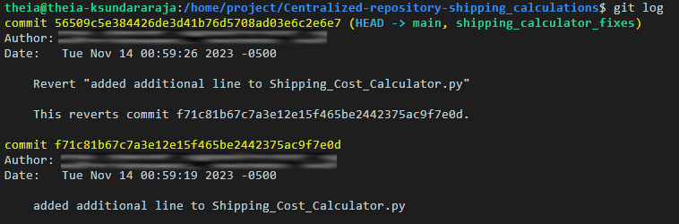

> Note: To exit the git log command, simply press the "Q" key. This action will close the log view and bring you back to the command prompt.

**With this action, all the commits from the `sipping_calculation_fixes` branch have been successfully pushed to the `main` branch in your forked repository**


# Task 4: Raise a pull request from your repository to the centralized collaboration repository

Now, you will contribute your project to the centralized collaboration repository for consideration and acceptance by the company authorities. 
> Since this is the centralized repo, only the company authorities have `write` and `Admin` access to it.

> You can only raise pull request to this and do not have access to merge it. 

1. Navigate to `Pull request` and click on `New pull request` in your GitHub repository.

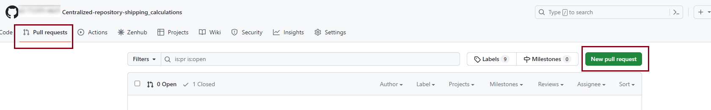

2. Select `compare across fork` , pick the relevant fields from the dropdown, and then click on `Create pull request`.

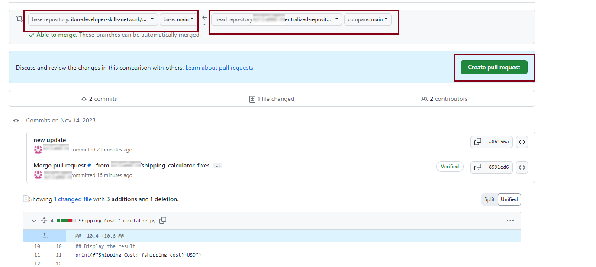

The `head repository` and the `compare` fields refer to the repository URL and branch, respectively, from where you want to initiate the pull request. In this instance, it is your GitHub repository.

The `base repostiory` and the `base` fields refer to the repository URL and branch, respectively, of the upstream repository where you intend to submit a pull request. In this instance, it is the centralized repository that you forked during task 1.

3. Include and appropriate comment and proceed to click on `Create pull request`

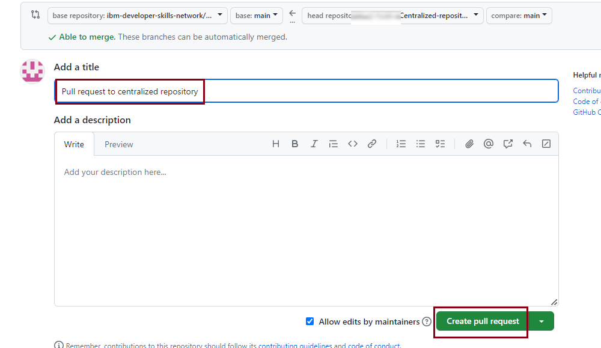

4. The displayed interface indicates that you have successfully submitted your lastest update to your company's centralized repository for collaboration.

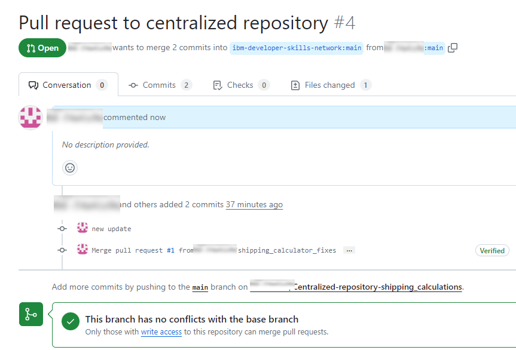

5. The pull request will undergo review and subsequently be merged by the administrators of the repository.

# Summary

In this lab, you forked the repository to your account and cloned it locally. You then created a new branch for making changes. After completing your modifications, you merged the branch back into `main`. You also learned to create pull request for collaboration. Finally, you explored the process fo reverting changes when needed. 