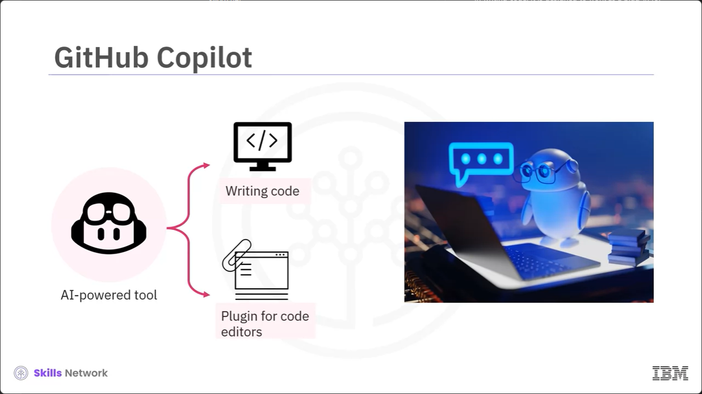
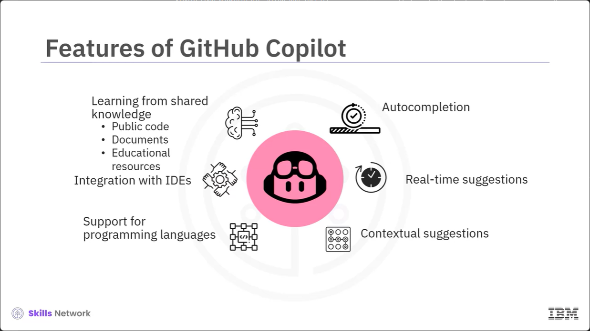
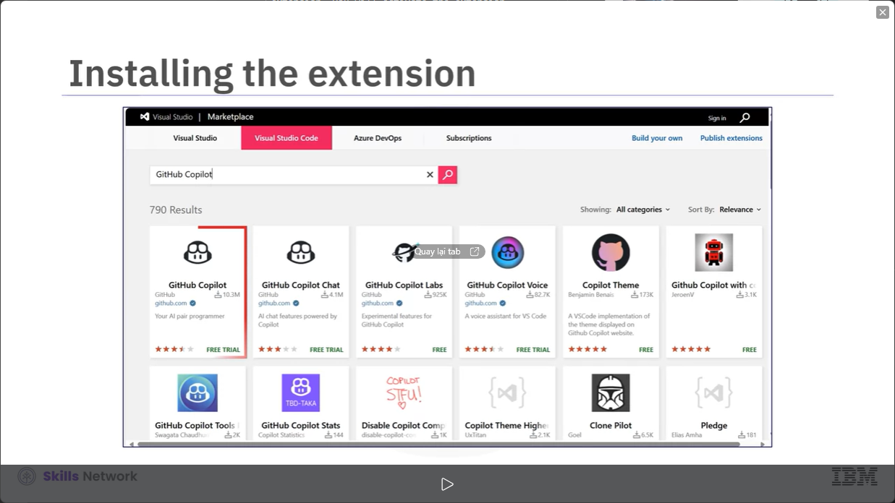
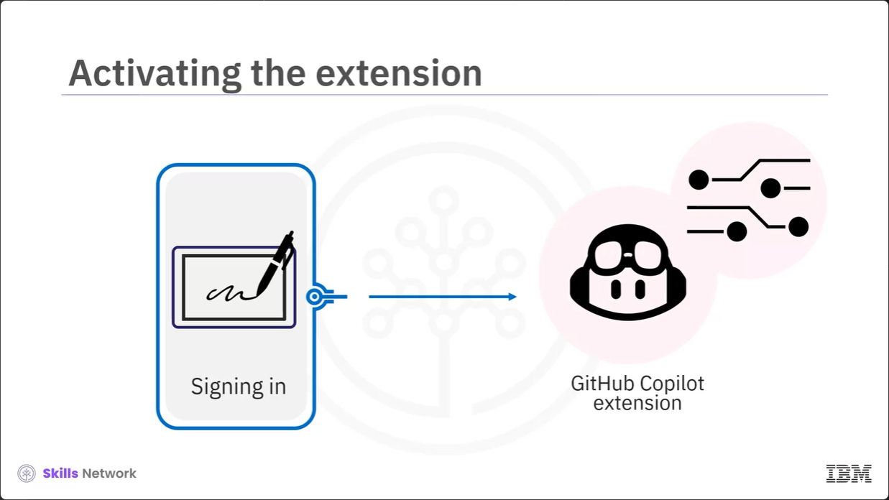
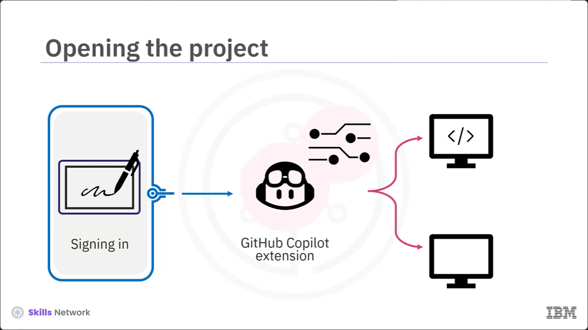
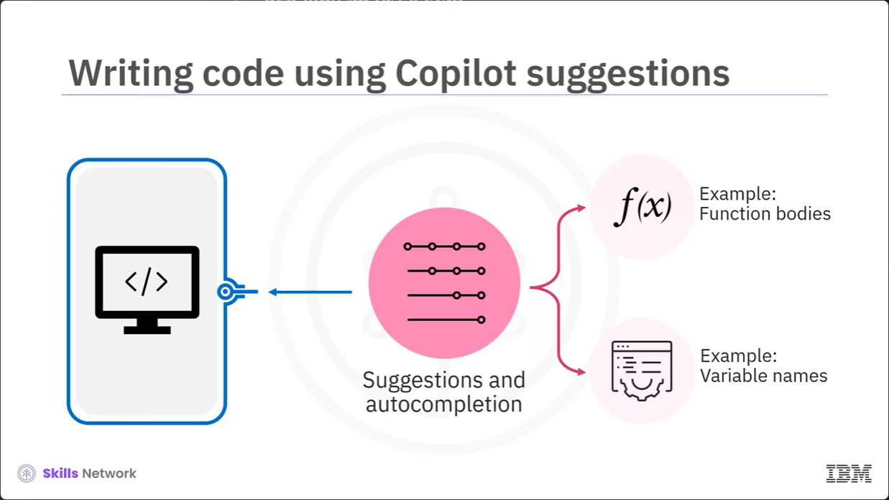
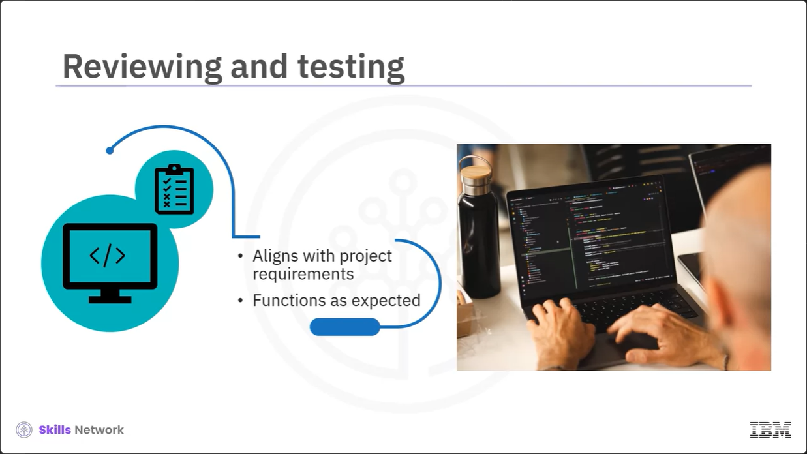
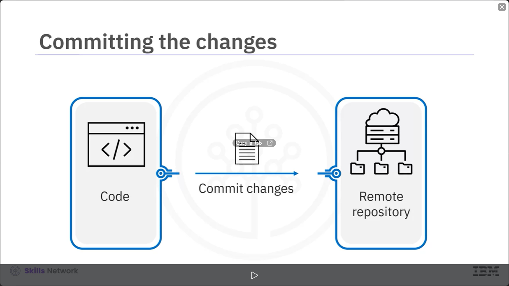
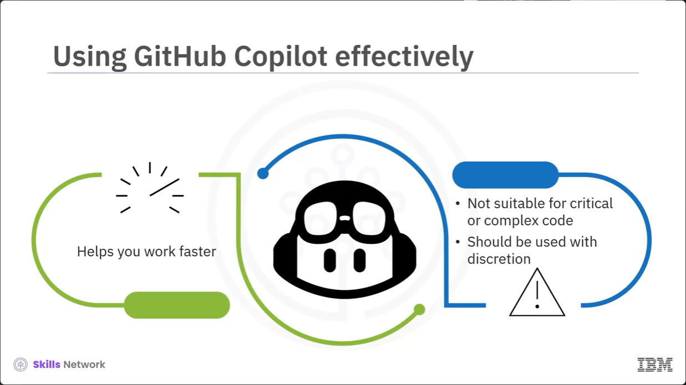

# Lesson 3.3.1 - GitHub  Copilot

# What you will learn

- Descibe the features of GitHub Copilot
- Describe the typical workflow in GitHub Copilot

# Scenario

Imagine you have a friend who teams up with you on a project, helping you write code faster and better by providing hints and suggestions, that would be awesome. 

GitHub Copilot is designed to do exactly this using the power of artificial intelligence or AI. 

# GitHub Copilot

GitHub Copilot is an AI power tool that assists developers in writing code. It is designed to work as a plug-in for various code editors, including Visual Studio code and provides contextual code suggestions. 

# Features of GitHub Copilot

Autocompletion:
- Functions 
- Classes
- Code structures

Let's look at the features of GitHub Copilot. The first one is code auto-completion. Github Copilot Suggests whole lines or blocks of code based on the context of the code you are currently working on. It can complete entire functions classes, or other code structure. 

Real-time suggestions:
- Repetitive or standard code 

GitHub Copilot offers real-time suggestions as you code, making the development process smoother. You can save time on writing repetitive or standard code.

Contextual suggestions:
- Function names
- Variable names
- Algorithms 

GitHub Copilot generates suggestions based on the code context including function names, variable names, and even algorithm implementation. 

For xample, while coding in a Python project, when you start writing a for loop and declare a variable such as total underscore, quantity, GitHub Copilot can provide suggestions for the loop structure and calculations. 

Support for programming languages :
- Python
- JavaScript
- Java
- C++

It supports a wide range of programming languages and it designed to provide you assistance across various popular languages such as Python, JavaScript, C++, and many more. 

Integration with IDEs:
- Pycharm 

GitHub Copilot integrates with various popular code editors and integrated development environments or IDs such as Pycharm. This makes it easy for you to access it from various development environments.

Learning from shared knowledge:
- Public code
- Documents
- Educational resources 

 GitHub Copilot keeps learning from the shared knowledge in public code, ducuments, and educational resources. It uses this knowledge to make better suggestions over time. 

# Using GitHub Copilot

How would you use GitHub Copilot in your work?
Let's look at the typical workflow that you might follow when using GitHub Copilot.

# Installing the extension

The first step is installing the GitHub Copilot extention in your Visual Studio code environment.
 You can find it in the Visual Studio code marketplace.
 

 # Activating the extension

  After you install the extension, you will activate the extension within Visual Studio code. 
  This step typically involves signing in with your GitHub account and allowing the necessary permission. 
  

# Opening the project

You will then open an existing coding project or create a new one.
GitHub Copilot will work within the context of the programming language and framwork you are using.

# Writing code using Copilot suggestions 

You will begin writing code as you normally would. You will begin writing code as you normally would. 
GitHub Copilot will start to provide suggestions and autocompletion based on the context of your code. 

For example, when you start writing a function in your code, GitHub Copilot generates funciton bodies.
Another example is where GitHub Copilot offers auto-completion suggestions for variable names when you begin declaring a new variable.
To accept a suggestion, you can use the tab key or select the suggestion.

# Reviewing and testing 

After generating or editing the code, you will review it to ensure it aligns with your project's requirements and best coding practices.
You will test the code to verify that it functions as expected.

# Debugging

If any problems come up, you will need to debug the code in the same way you would with any other code.

 GitHub Copilot does not help you with debugging.
 So it's important to perform this step to make sure the code works properly.
 
 
 
# Commiting the changes

 After you are satisfied with the code, you can commit the changes to your version control system such as Git, and push the changes to the remote repository.

 Make sure you document any code changes or additions with comments and explanations so that other developers can easily comprehend the code. 

# Using GitHub Copilot effectively

 GitHub Copilot helps you work faster, especially with repetitive or standard code segments.
 However, remember that it is just a tool to assist you and must not be relied upon for writing critical or complex code. 
 You should use it wisely,review suggestions, and make sure the code is good, secure, and follows best practices. 

# Summary 

- GitHub Copilot is an AI-Powered tool that assists developers in writing code.

- It provides featues such as code autocompletion and real-time and contextual code suggestions.

- It supports a wide range of programming languages, popular code editors, and IDEs.

- It keeps learning from shared knowledge to make better suggestions over time.

- You can install the GitHub Copilot extension, activate it, and use it for existing projects or new projects.

- You must review GitHub suggestions, address issues throught debugging, and ensure the code is good and follows best practices. 