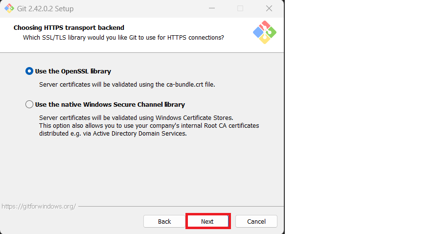

# GitBash Installation on Desktop

# What is Git Bash?

Git Bash for Windows is simply a package that includes both *Git* and *Bash*

Git is an open-source version control system for tracking source code changes when developing software.
It keeps a commit history that allows you to revert to a stable state in case you make errors in your code.
Git also enables multiple developers to collaborate on the same code base. 

Bash is a Unix command-line shell.
The name is an acronym for *Bourne-Again Shell*.
It comes with useful Unix commands like cat, ssh, SCP, etc.,
Which are not usually found on Windows. 

# Installing Git Bash for Windows

To install Git Bash for Windows on your local system, complete the following steps:

1. Go to the [Git download page](https://git-scm.com/downloads) .
Click **Download for Windows** as shown in the following image:

You will be redirected to a new page, and you can select the Windows Intaller as per the system configuration.

2. Navigate to the directory where the file has been downloaded, typically the default Downloads foler, and then double-click to open it.

3. Click **Next** to begin the installation.

4. Select the location whre you want to install Git Bash.
**Note:** It's recommended that you simply install in the default location.
Click **Next**

5. Choose the componets you want to install, or simply have the default options selected. 
Click **Next**

6. You can change the name of the start menu folder or simply leave the default name as is. 
Click **Next**.

7. Selet the default editor for Git to use. 
Click **Next**

Click **Next** and let Git decide.

8. Choose how you want to use Git from the command line.
Click **Next**

9. Select **Use bundled openSSH**  and **Use the OpenSSL library**. Click **Next**

10. Configure your line ending conversions for Windows by selecting the default option, **Checkout Windows-style, commit Unix-style line endings**. Click **Next**

11. Configure your terminal emulator to use with Git Bash by selecting the default option **Use MinTTY (the default terminal of MSYS2)**, click **Next**

12. Configure the default behavior for a `git pull` by selecting **Default (fast-forward or merge)**. 
Click **Next**

13. Choose a **Git Credential Manager**. Click **Next**

14. Select any additional options you want to install. (The default option is sufficient to use Git Bash successfully). 
Click **Next**

15. You can enable experimental optons if you choose to. By enabling these options, you will be able to try newer features that are still being developed. However, you do not have to select any experimenal options to use Git Bash. Click **Install** to complete the installation with the options you have chosen. The installation runs, and when complete, a Completing the Git Setup Wizard window opens.

16. Leave the checkboxes selected and lick **Next**.

The Git Bash terminal opens. You are now able to enter Git and Bash commands. 

# Suummary

You have now successfully installed and lauched Git Bash for Windows. 