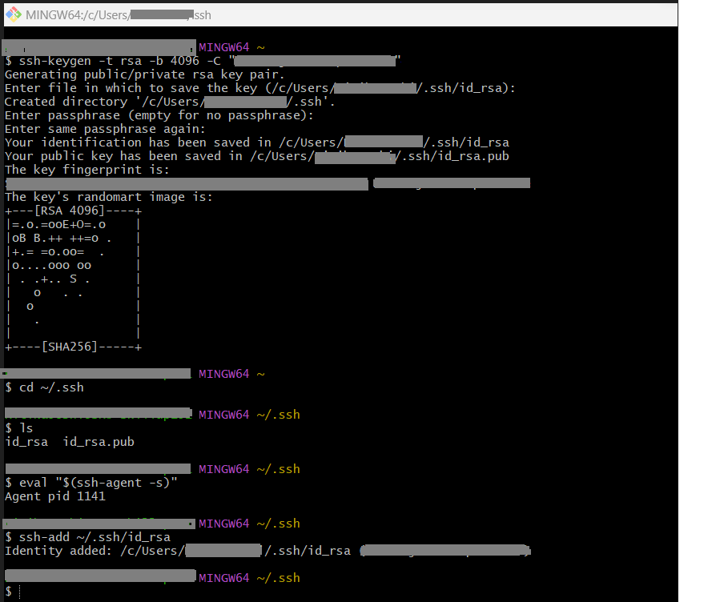

# SSH Key Creation

# What is an SSH key?

An SSH key is an access credential in the SSH protocol. Its function is similar to that of user names and passwords, but the keys are primarily used for automated processes. 

# Generating and SSH key

To generate an SSH key, complete the following steps:

1. Launch a terminal. If you are using Windows, launch Git Bash.

2. Type the following command in your terminal, replace <your email address> with the email address that is linked to your Github account. When you have typed the command press Enter.

```
ssh-keygen -t rsa -b 4096 -C "<your email address>"
```

A new SSH key is generated.

3. You will be prompted to enter a directory to save the key. You can simply press Enter to accept the default location, which is an .ssh folder in the home directory. This means you will be able to locate the key in `~/.ssh/id_rsa`

4. You will be prompted to choose a passphrase. You also have the option not to create a passphrase. To skip the passphrase, press Enter twice to confirm that the passphrase is empty.

5. Optional: To navigate to the .shh directory, and check the contents of the directory, run the follwing commands in the terminal:

```
cd ~/.ssh
```

and then
```
ls
```

When you list the contents of the .ssh directory, you should see `id_rsa` and `id_rsa.pub` in the list of contents, where `id_rsa` is the private version of your key and `id_rsa.pub` is the public version of your key.

6. You now need to add the SSH key to the ssh-agent, which helps with the authetication process. To start the ssh-agent, run the following command in the terminal
```
eval "$(ssh-agent -s)"
```

7. To add the key to the agent, run the following command in the terminal:
```
ssh-add ~/.shh/id_rsa
```

8. Please find Screenshot for reference:



# Summary

You have now learned how to generate the SSH key.
