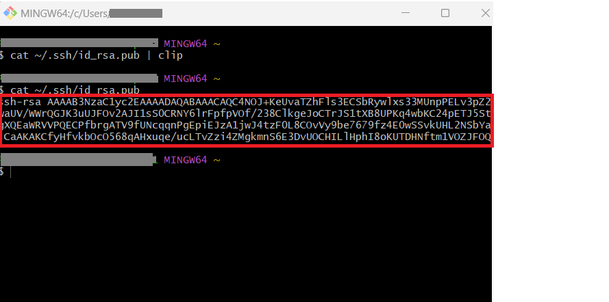
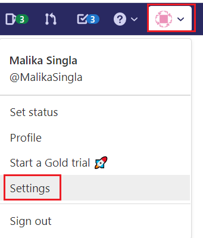
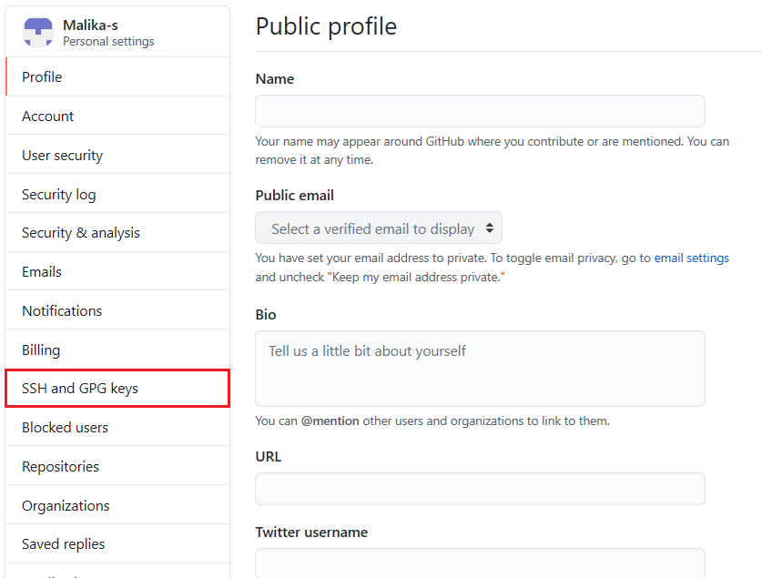
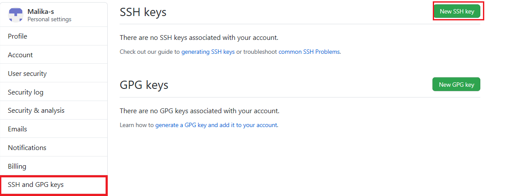
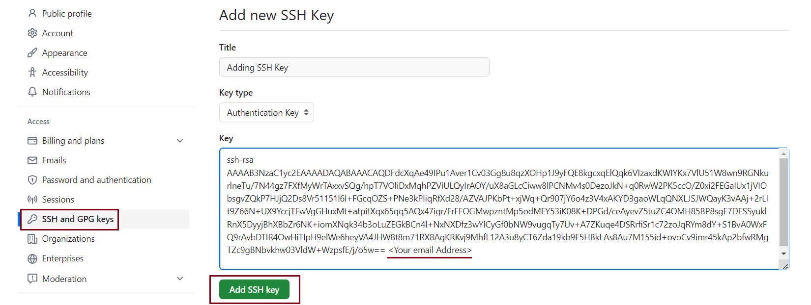

# Lab: Add SSH to Repo

# Prerequisites

This hands-on lab requires you to have already generated an SSH key. See the [Generating an SSH key](./Lab_4_2-SSH_Key_Creation.md) lab for instructions.

# Steps

To add an SSH key to GitHub, you need to copy the SSH key that you generated in the previous lab. Open a terminal and then complete the following steps:

**Note**: Please be aware that these commands are specifically intended for eecution in the Git Bash terminal and may not function properly in the regular command prompt.

1. In the terminal, run the following command:
```
cat ~/.ssh/id_rsa.pub | clip
```
> **Note**: if `clip` doesn't work, run `cat ~/.ssh/id_rsa.pub` in the command line and the copy the output 



2. Sign in to GitHub. At the top right, click the drop-down menu on your profile image and select Settings.


3. From the "Personal settings" menu, select **SSH and GPG keys,** as shown in the following image:



4. Click **New SSH key**



5. Enter a **Title** for the new SSH key. In the **Key** field, paste the key that you copied in step 1 above which should include **Your email address** at the end. Finally, click on **Add SSH key**:


6. Enter your Github password in the next window that opens. With this, the SSH key will be added to your account.

# Summary

You have now learned how to add an SSH key to GitHub.
