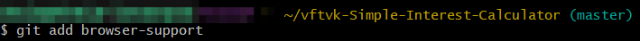

# Lab 4.4 Using Git from Your Own Desktop

# Objectives

After completing this lab, you will able to:

1. Clone your GitHub repository locally.

2. Make changes to the cloned files.

3. Add a new file.

4. Check the status.

5. Commit changes.

6. Generate Personal Access Token.

7. Push the changes back to GitHub.

# Pre - requisities

GitHub account, with a project in it, as illustreated in [this lab](/Module_1-Git_and_Github_Fundamentals/1_1-Getting_Started_with_Git_and_Github/Lab_1_1-GitHub_Sign_Up_and_Create_Repo.md)

GitBash or Git installed on your local desktop, as in [this lab](/Module_4-Using_GitHub_from_your_Windows_Desktop/Lab_4_1-GitBash_Installation_on_Desktop.md)

Create SSH keys, as in [this lab](./Lab_4_2-SSH_Key_Creation.md)

Add SSH Key to GitHub, as in [this lab](./Lab_4_3-Add_SSH_to_Repo.md)

# Exercise 1: Clone a repo

To clone a repo, you need the SSH URL of the repo.

1. To get the SSH URL, login into GitHub.

2. Navigate to the repo you wish to clone.

3. Click the `Code` button.

4. Click the 'Clipboard icon' to copy the SSH URL. Paste this URL where you can access it later.

5. On your desktop, open a terminal or GitBash, if you are using Windows OS.

6. Navigate to a directory where you wish to clone the repo.

7. Run the command `git clone <your repo ssh url>`

8. This will clone the repo on GitHub into your current directory.

9. You can see all the downloaded files under a directory named as your repo name.

10. To ensure that every file was downloaded, navigate to the cloned directory and list the files.

# Exercise 2: Make changes to cloned files

1. Using your favourite editor, make changes to the HTML file.

2. `git status` will show all the modified files

# Exercise 3: Add a new file to the local repo

1. Let us add a new file to the local repo.

2. Using a text editor, create a new file **browser-support.txt**

3. Add "Chrome, Firefox, Edge" into the file.

4. Save the file.

# Exercise 4: Check the status

1. Run `git status` to see infor on the modified files.

2. Add the file to the repository for commiting using `git add browser-support.txst`

# Exercise 5: Commit and push the changes

1. Git commit will record all the changes into the local stting area. To commit the changes you have made, run `git commit -m 'added a new file browser-support.txt`

Now all the changes you have made this far, get committed locally.

2. The git `push` command will enalbe you to sync all the changes made locally to the GitHub web repostiory. Run the `git push` commadn in GitBash terminal.

You can now vist the GitHub repository page and check to ensure that the revised and newly added files are in place.

# Summary

You have learned how to clone a GitHub repository, make changes to it , commit the changes locally, and push it back to GitHub.